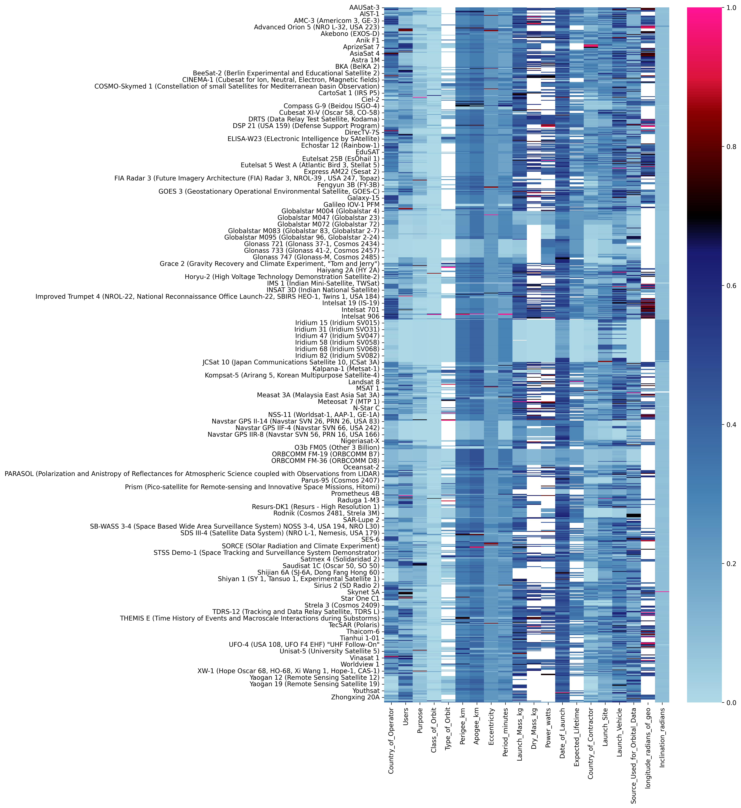

+++
title = "Improve your data with model-based anomaly detection"
date = 2022-04-25
template = "post.html"
draft = false

[taxonomies]
categories = ["data science", "anomaly detection", "ai"]

[extra]
author = "Baxter Eaves"
subheading = "Learn how to find outliers, anomalies, and hidden errors to protect you and your customers, and keep data quality high"
image = "cleaner-shrimp.jpeg"
image_attr = "'Lysmata amboinensis in Tropicarium-Oceanarium Budapest' from Wikipedia user Хомелка"
+++

Bad and badly-behaved data is the scourge of the data scientist &mdash; bad
data produce bad information, which produces bad models &mdash; but
unfortunately it is the norm. Thus, the data science workflow always begins
with Exploratory Data Analysis (EDA): let's describe the data. What are the min
and max values? What are the quantiles? What data are missing? Do we have many
outliers? But EDA doesn't catch everything. Often we find broken data via
broken or poorly performing models, or via failure in production. The hope is
that every time a data scientist works with a dataset, the data set improves a
little, but still, bad data can lurk for years.

Here, we'll explore different anomaly and error detection methodologies based
on distances and model-building, and show how we can find and explain anomalies
with just a few lines of code.

# The data

We'll be looking at [the Union of Concerned Scientists satellite
dataset](https://www.ucsusa.org/resources/satellite-database). Each row of the
dataset is an earth-orbiting satellite. The features include orbital
characteristics like apogee (the high point of an orbit) and period (the time
it takes to complete an orbit), and logistical features like launch vehicle and
launch site. There are a mixture of categorical and continuous variables and a
lot of the data are missing. In fact, every satellite has at least one feature
missing, and some of the features have more than half their values missing.
And, since we're talking about values on the scale of space, we can have an extreme
range of data for some features interspersed with important clusters of data
that occupy only a tiny interval on that range. In short: the data are
challenging.

Let's hunt down anomalies.

We'll start by looking for anomalies in the `Period_minutes` variable, which is
the time in minutes it takes for a satellite to complete an orbit. Here is
what the data look like:


**Above**: Histogram of `Period_minutes`. Y-axis is log scaled.

There are three main clusters of periods corresponding to standard orbit
classes: Low Earth Orbits (LEO) are around 100 minutes, Medium Earth Orbits
(MEO) are around 680 minutes, and geosynchronous (GEO) orbits are around 1436
minutes. Beyond that there are higher orbits, elliptical orbits, and satellites
sitting in LaGrange points that barely orbit at all.

# Anomalies as things that are dissimilar

One may conceptualize anomaly in terms of (dis)similarity. If most data are
similar to each other, anomalies are those that are dissimilar. To actualize
this definition, we'll need to determine two things: how to determine how
similar or dissimilar data are, and the reference point. We'll discuss two
options for building anomaly detection using dissimilarity.

## Anomalies as extreme values or outliers

An outlier is a type of anomaly. It is a value that is anomalous because it is
extreme. The reference point for an outlier is usually the mean of the data,
and the measure of dissimilarity is distance away from the mean. It is then up
to the practitioner to determine how much distance from the mean is 'extreme'.
Often a value is considered an outlier if it is more than three standard
deviations away from the mean. This is of course a distance-based outlier
definition, which would not work for categorical values, which do not often
permit a straightforward distance metric. Categorical variables aside, this is
easy enough to compute. In our data we can do something like this

```python
import pandas as pd

# read in the data using pandas
df = pd.read_csv('satellites.csv', index_col=0)

# pull just the period and drop missing values
period = df.Period_minutes.dropna()

mean = period.mean()   # mean
sigma = period.std()   # standard deviation
low = mean - 3 * sigma
high = mean + 3 * sigma
```

Low is -1917.88 and high is 3319.99. There is already a problem. Do you see it?
Low is very much negative. Orbital period can never be negative. So, using the
three sigma outlier definition completely fails to capture low-valued outliers.
Zero is only 0.804 standard deviations away from the mean, which is hardly far.
This is happening because the 3-sigma outlier method relies on the
data being close to normally-distributed. Irrespective of this very strong
requirement, this method of *distance from the mean* is used often in practice
on data that clearly violate normality.

Regardless, let's write the code and see what which data are the farthest from
the mean.

```python
outlier = pd.DataFrame({
    'period': period,
    'distance': ((period - mean).abs() / sigma), # n sigmas away from mean
})

outlier \
    .sort_values(by='distance', ascending=False) \
    .head(20)
```

|                                                                                |   period |   distance |
|:-------------------------------------------------------------------------------|---------:|-----------:|
| Wind (International Solar-Terrestrial Program)                                 | 19700.5  |  21.7639   |
| Integral (INTErnational Gamma-Ray Astrophysics Laboratory)                     |  4032.86 |   3.8166   |
| Chandra X-Ray Observatory (CXO)                                                |  3808.92 |   3.56007  |
| Tango (part of Cluster quartet, Cluster 2 FM8)                                 |  3442    |   3.13977  |
| Rumba (part of Cluster quartet, Cluster 2 FM5)                                 |  3431.1  |   3.12728  |
| Samba (part of Cluster quartet, Cluster 2 FM7)                                 |  3430.28 |   3.12634  |
| Salsa (part of Cluster quartet, Cluster 2 FM6)                                 |  3418.2  |   3.1125   |
| XMM Newton (High Throughput X-ray Spectroscopy Mission)                        |  2872.15 |   2.487    |
| Geotail (Geomagnetic Tail Laboratory)                                          |  2474.83 |   2.03187  |
| THEMIS E (Time History of Events and Macroscale Interactions during Substorms) |  1875.53 |   1.34537  |
| THEMIS A (Time History of Events and Macroscale Interactions during Substorms) |  1868.98 |   1.33787  |
| THEMIS D (Time History of Events and Macroscale Interactions during Substorms) |  1867.91 |   1.33664  |
| Express-AM44                                                                   |  1446.57 |   0.853994 |
| AEHF-1 (Advanced Extremely High Frequency satellite-1, USA 214)                |  1446.36 |   0.853753 |
| Apstar 7                                                                       |  1440.31 |   0.846823 |
| Badr 5 (Arabsat 5B)                                                            |  1439.76 |   0.846193 |
| SES-3                                                                          |  1439.41 |   0.845792 |
| Intelsat New Dawn                                                              |  1439.15 |   0.845494 |
| Advanced Orion 4 (NRO L-26, USA 202)                                           |  1438.8  |   0.845093 |
| Astra 1M                                                                       |  1438.2  |   0.844406 |

<!--
If we render these points on top of the histogram:


**Above**: Data farthest from the mean (red) overlaid on the histogram of
`Period_minutes`. Y-axis is log scaled.
-->

Basically, it's the values sorted in descending order, which is no good. We're
starting to see normalish geosynchronous orbital periods to sneak in. And,
because we've just used a distance as a proxy for anomalousness, we can't
actually be sure that those values are indeed anomalous.

We need a better way to define anomalies.

## Anomlies as values that are dissimilar to what we would predict

Perhaps it is more robust to define an anomaly thusly:

> An anomaly is something that deviates from our expectation

This turns out to be a definition in terms of prediction. The predicted value
is where we would expect the value to be (our reference point), and we will
measure deviation in terms of distance. We can use any model we like to make
the reference prediction, but here we'll use Redpoll.

To upload our data, learn a (Bayesian) model describing the data, and
deploy our model to a web service, we need four lines of code:

```python
import redpoll as rp

rp.upload('satellites.csv', name='satellites')
rp.fit('satellites')

# Creates a web service giving us access to the model and
# returns a client into the web service
c = rp.deploy('satellites')
```

Now we can compute prediction-based anomaly. In code:

```python
# collect the predictions and true values
preds = []
truths = []
ixs = []

# iterate through each row in the dataframe
for ix, row in df.iterrows():
    # Convert the pandas.Series row into a dict 'given' for
    # Redpoll to build a conditional distribution
    given = row.dropna().to_dict()
    truth = given.pop('Period_minutes', None)

    # if we don't know the truth, we can't compute a
    # deviation. skip
    if truth is None:
        continue

    # Predict period given the rest of the data in the row.
    # do not compute uncertainty
    pred = c.predict(
        'Period_minutes',
        given=given,
        uncertainty_type=None
    )

    truths.append(truth)
    preds.append(pred)
    ixs.append(ix)

df_pred = pd.DataFrame({
    'Period_minutes': truths,
    'pred': preds,
}, index=ixs)

# absolute deviation
deviation = (df_pred.Period_minutes - df_pred.pred).abs()
df_pred['deviation'] = deviation

# take the items with the most deviation form the prediction
df_pred \
    .sort_values(by=['deviation'], ascending=False) \
    .head(10)
```

|                                                               |   Period_minutes |     pred |   deviation |
|:--------------------------------------------------------------|-----------------:|---------:|------------:|
| Wind (International Solar-Terrestrial Program)                |         19700.5  | 2730.18  |   16970.3   |
| Spektr-R/RadioAstron                                          |             0.22 | 1709.2   |    1708.98  |
| SDS III-6 (Satellite Data System) NRO L-27, Gryphon, USA 227) |            14.36 | 1436.17  |    1421.81  |
| SDS III-7 (Satellite Data System) NRO L-38, Drake, USA 236)   |            23.94 | 1436.15  |    1412.21  |
| Advanced Orion 6 (NRO L-15, USA 237)                          |            23.94 | 1436.1   |    1412.16  |
| DSP 20 (USA 149) (Defense Support Program)                    |           142.08 | 1436.15  |    1294.07  |
| Interstellar Boundary EXplorer (IBEX)                         |             0.22 |  992.416 |     992.196 |
| Integral (INTErnational Gamma-Ray Astrophysics Laboratory)    |          4032.86 | 3377.03  |     655.826 |
| Geotail (Geomagnetic Tail Laboratory)                         |          2474.83 | 1959.37  |     515.459 |
| XMM Newton (High Throughput X-ray Spectroscopy Mission)       |          2872.15 | 3377.03  |     504.884 |

Rendered:


**Above**: Data farthest from the predicted values (red) overlaid on the
histogram of `Period_minutes`. Y-axis is log scaled.

Wind, the most extreme value, is still most anomalous under this definition.
Then we see a bunch of low values rather than high values. We see some 0.22
minute orbits, which are un-physical and probably data entry errors. But then it
gets more subtle. SDS III-6 is listed as having a 14.36 minute orbit, but is
expected to have a 1436 minute orbit. This looks like a decimal error. Then SDS
II-7 and RNO L-15 have 23.94-minute orbits, but are again expected to have
1436-minute orbits because they're geosynchronous satellites. This looks like a
units error &mdash; the user entered the data in hours rather than minutes.

As useful as it is, this definition of anomaly suffers from the requirement of
a distance metric. This means that anomalies on the edge of narrow modes are
less likely to be detected than anomalies on the edges of wide modes.  Let's
try to free ourselves from distance with model-based anomaly.

# (Bayesian) model-based anomaly

The only way we're going to be able to develop tools to convincingly explain
anomalies is by using a (Bayesian) model-based definition of anomalousness.
Explanation requires understanding how variables interact; we formalize these
interactions with a model. The caveat is that, whereas before we just needed a
distance metric, now we need a Bayesian model of the whole data process. One
might be inclined to think this a great deal more difficult, but it's
really not if we're using Redpoll because building Bayesian models is what
Redpoll does. 

We've actually already built and deployed a Bayesian model. All that is left to
do is to define anomalousness in terms of probabilities (or likelihoods) and
extract those probabilities from Redpoll.

## Anomalies as unlikely observations

If an anomaly is something that is unlikely, let's just define it that way. 

> An anomaly is an unlikely value

We have access to likelihoods via Redpoll. But what we're interested in is the
un-likelihood of a value in a particular position in the data table. Redpoll
has a query just for that:

```python
surp_period = c.surprisal('Period_minutes')
```

Surprisal is the negative log likelihood of a value in a particular cell (at
row \\\(r\\\) and column \\\(c\\\)) in the table.

$$
s(x) = -\log p(x | r, c)
$$

Executing the `surprisal` method as above computes the surprisal of every
non-missing value in the column. Let's look at the top 20 most surprising
values.

```python
surp_period \
    .sort_values(by=['surprisal'], ascending=False) \
    .head(20)
```

|                                                                                |   Period_minutes |   surprisal |
|:-------------------------------------------------------------------------------|-----------------:|------------:|
| Wind (International Solar-Terrestrial Program)                                 |         19700.5  |    13.8845  |
| Spektr-R/RadioAstron                                                           |             0.22 |     9.5232  |
| Interstellar Boundary EXplorer (IBEX)                                          |             0.22 |     9.49467 |
| Integral (INTErnational Gamma-Ray Astrophysics Laboratory)                     |          4032.86 |     9.18249 |
| Geotail (Geomagnetic Tail Laboratory)                                          |          2474.83 |     9.1438  |
| Chandra X-Ray Observatory (CXO)                                                |          3808.92 |     8.92203 |
| XMM Newton (High Throughput X-ray Spectroscopy Mission)                        |          2872.15 |     8.91011 |
| Tango (part of Cluster quartet, Cluster 2 FM8)                                 |          3442    |     8.34124 |
| Rumba (part of Cluster quartet, Cluster 2 FM5)                                 |          3431.1  |     8.31092 |
| Samba (part of Cluster quartet, Cluster 2 FM7)                                 |          3430.28 |     8.30876 |
| Salsa (part of Cluster quartet, Cluster 2 FM6)                                 |          3418.2  |     8.2791  |
| THEMIS E (Time History of Events and Macroscale Interactions during Substorms) |          1875.53 |     8.05719 |
| THEMIS A (Time History of Events and Macroscale Interactions during Substorms) |          1868.98 |     8.05622 |
| THEMIS D (Time History of Events and Macroscale Interactions during Substorms) |          1867.91 |     8.0562  |
| Sirius 1 (SD Radio 1)                                                          |          1418.5  |     7.88695 |
| Sirius 3 (SD Radio 3)                                                          |           994.83 |     7.84157 |
| Sirius 2 (SD Radio 2)                                                          |          1148.43 |     7.7877  |
| Akebono (EXOS-D)                                                               |           150.4  |     7.27144 |
| AEHF-3 (Advanced Extremely High Frequency satellite-3, USA 246)                |          1306.29 |     7.24799 |
| AEHF-2 (Advanced Extremely High Frequency satellite-2, USA 235)                |          1306.29 |     7.24799 |

Rendered:


**Above**: Data with the highest surprisal (red) overlaid on the histogram of
`Period_minutes`. Y-axis is log scaled.

We see a lot of extreme values in the very most surprisng values. Again, the
most surprising period belongs to the satellite with the longest period; then
we have two low-extreme values. Spektr and IBEX have 0.22 minute orbits, which
put them moving at about 1% the speed of light, which is probably a data entry
error since even a low-earth satellite takes about 100 minutes to orbit.
Toward the bottom, we see some mid-range values: the THEMIS satellites have
1800-minute orbits, and the AEHF satellites have 1300 minute orbits. These orbit
times are just a little too high or too low to be perfectly geosynchronous,
which puts them in a low-likelihood region between orbit classes.

While this is a ton better than using standard deviations or encoding a bunch
of heuristics, we're still missing something. What about really tricky
anomalies: anomalies that hide in the nominal values, anomalies that cannot be
recognized or explained on first sight &mdash; *contextual anomalies*?

## Contextual anomalies or: anomalies as things that we would not expect to be unlikely

A contextual anomaly is an anomaly that has a completely nominal value that
doesn't make sense given its other values. How the heck do we find these? We
change the definition of anomaly again:

> An anomaly is a value that we do not expect to be unlikely

Now here is where Redpoll really shines. Redpoll doesn't just emit one joint
distribution over the whole dataset, it gives you access to any conditional
distribution or baseline distribution (e.g. if \\\( p(x, y) \\\) is the joint
distribution of x and y, and \\\(p(x|y)\\\) is the conditional distribution of
x given y, then \\\(p(x)\\\) is the baseline distribution of x).

The baseline likelihood \\\(p(period)\\\) tells us how likely a period is at
baseline &mdash; ignoring all other variables. So, to get at those tricky
anomalies hiding in the brush of the high-likelihood regions, we can scale the
surprisal by the negative baseline likelihood, which has the effect of
down-weighting surprisal in regions with low baseline likelihood.

$$
\hat{s}(x) = \frac{s(x)}{-\log p(x)}
$$

Note that \\\(-\log p(x)\\\) is different from the surprisal, \\\(-\log p(x |
r, c) \\\), because the latter implicitly carries along with it the information
in the rest of the columns in the row.

In Redpoll, scaled surprisal is trivially computed:

```python
logp_period = c.logp(surp_period.Period_minutes)  # log p(x)
surp_period['scaled'] = surp_period.surprisal / -logp_period
```

And taking the top 20

```python
surp_period \
    .sort_values(by=['scaled'], ascending=False) \
    .head(20)
```

|                                                                                                                     |   Period_minutes |   surprisal |   scaled |
|:--------------------------------------------------------------------------------------------------------------------|-----------------:|------------:|---------:|
| Intelsat 903                                                                                                        |          1436.16 |     6.60304 |  1.59428 |
| Intelsat 902                                                                                                        |          1436.1  |     6.53567 |  1.57804 |
| Mercury 2 (Advanced Vortex 2, USA 118)                                                                              |          1436.12 |     5.48201 |  1.32363 |
| Sirius 1 (SD Radio 1)                                                                                               |          1418.5  |     7.88695 |  1.32083 |
| JCSat 4A (JCSAT 6, Japan Communications Satellite 6)                                                                |          1435.52 |     5.2171  |  1.25906 |
| QZS-1 (Quazi-Zenith Satellite System, Michibiki)                                                                    |          1436    |     5.13623 |  1.24014 |
| Compass G-7 (Beidou IGSO-2)                                                                                         |          1436.12 |     4.98403 |  1.20339 |
| Compass G-10 (Beidou ISGO-5)                                                                                        |          1436.08 |     4.98383 |  1.20335 |
| Compass G-8 (Beidou IGSO-3)                                                                                         |          1435.93 |     4.98308 |  1.20313 |
| Compass G-5 (Beidou IGSO-1)                                                                                         |          1435.82 |     4.98254 |  1.20292 |
| Compass G-9 (Beidou ISGO-4)                                                                                         |          1435.1  |     4.97915 |  1.20039 |
| INSAT 4CR (Indian National Satellite)                                                                               |          1436.11 |     4.90879 |  1.18523 |
| IRNSS-1A (Indian Regional Navigation Satellite System)                                                              |          1436    |     4.90823 |  1.18509 |
| TianLian 2 (TL-1-02, CTDRS)                                                                                         |          1436.1  |     4.80361 |  1.15983 |
| SDO (Solar Dynamics Observatory)                                                                                    |          1436.03 |     4.71832 |  1.13924 |
| Keyhole 7 (NRO L65, Advanced KH-11, Improved Crystal, USA 245)                                                      |            97.25 |     4.51819 |  1.05612 |
| Keyhole 4 (Advanced KH-11, Advanced Keyhole, Improved Crystal, EIS-2, 8X Enhanced Imaging System, NROL 14, USA 161) |            97.13 |     4.51873 |  1.05575 |
| Keyhole 6 (NRO L49, Advanced KH-11, KH-12-6, Improved Crystal, USA 224)                                             |            97    |     4.51934 |  1.05532 |
| Keyhole 5 (Advanced KH-11, KH-12-5, Improved Crystal, EIS-3, USA 186)                                               |            97    |     4.51934 |  1.05532 |
| Lacrosse/Onyx 4 (Lacrosse-4, USA 152)                                                                               |            97.21 |     4.20131 |  0.9819  |

Rendered:


**Above**: Data with the highest scaled surprisal (red) overlaid on the
histogram of `Period_minutes`. Y-axis is log scaled.

That is more interesting. We have a bunch of periods in the 1436 minutes range,
which is a bog-standard geosynchronous orbit. Ok, great. Redpoll flagged
Intelsat 903 as having an anomalous period, but because this is a *contextual*
anomaly, we can't tell why it's anomalous from looking at it. What do we do?
We can ask Redpoll to tell us why.

We'll use Redpoll to compute the negative log likelihood of Intelsat 3's period
while progressively dropping the features that contribute the most to
surprisal. We do this using `rp.analysis.held_out_neglog`, which returns

- `ks`: the keys, or names, of the feature dropped at each step. The first
    entry is always `''`, which is no keys dropped.
- `ss`: `ss[i]` is the surprisal as a result of dropping the keys `ks[:i+1]`

```python
from redpoll import analysis

# get the row corresponding to the satellite in question and
# convert it to a dict of given conditions to create
# conditional probability distributions
row = df.loc['Intelsat 903', :]
given = row.dropna().to_dict()

# extract the target value
obs = given.pop('Period_minutes')

# analyze the surprisal as a function of dropping predictors
ks, ss = analysis.held_out_neglogp(
    c, 
    pd.Series([obs], name='Period_minutes'),
    given
)
```

Plotting `ss` (surprisal) as a function of `ks` (dropped key) gives us this:


When we predict period with all features in, surprisal is about 6.6. Then we
drop Apogee, and the surprisal stays about 6.6. Then we drop both apogee and
eccentricity, which causes the surprisal to plummet. So, it looks like apogee
and eccentricity are responsible for the anomalousness. **Note**: That uptick
in surprisal on the right, after all features have been dropped, is a return to
ignorance &mdash; predicting given no inputs (weird to think about), which is
the baseline distribution. The baseline distribution, \\\(p(period)\\\) is
flatter on average which makes the average surprisal higher.

Let's take a look at the whole row of data for Intelsat 903.

```python
c.get_row('Intelsat 903')
```

|                              | Intelsat 903        |
|:-----------------------------|:--------------------|
| Country_of_Operator          | USA                 |
| Users                        | Commercial          |
| Purpose                      | Communications      |
| Class_of_Orbit               | GEO                 |
| Perigee_km                   | 35773.0             |
| Apogee_km                    | 358802.0            |
| Eccentricity                 | 0.7930699999999999  |
| Period_minutes               | 1436.16             |
| Launch_Mass_kg               | 4723.0              |
| Dry_Mass_kg                  | 1972.0              |
| Power_watts                  | 8600.0              |
| Date_of_Launch               | 37345.0             |
| Expected_Lifetime            | 13.0                |
| Country_of_Contractor        | USA                 |
| Launch_Site                  | Guiana Space Center |
| Launch_Vehicle               | Ariane 44L          |
| Source_Used_for_Orbital_Data | JM/12_08            |
| longitude_radians_of_geo     | -0.603011257        |
| Inclination_radians          | 0.000349066         |

It's a geosynchronous satellite alright. But look: the Apogee is an order of
magnitude greater than the Perigee. This doesn't make sense because the period
is normal. Something is wrong. Looking up the [satellite's
details](https://heavens-above.com/orbit.aspx?satid=27403), it looks like the
apogee was entered incorrectly and either the eccentricity was completely
fabricated or, more likely, a spreadsheet formula was used to calculate
eccentricity from apogee and perigee.

Why wasn't this caught when we defined anomalousness as deviation from the
prediction? Let's plot the predictive likelihood as a function of the
predictors that were dropped. This is the same plot as above, but we see the
entire predictive likelihood rather than just the surprisal.

```python
analysis.combined_hold_out_plot(
    c, 'Period_minutes', given, ks, (0, 1600), 
    obs=obs, slant=1.0, offset=3, xlabel='Period_minutes'
)
```


Each row of the plot is a likelihood and the red dot is the observed value. The
predicted value is the high point on the likelihood. So, it looks like we
didn't detect this period as deviating from the prediction because it *doesn't*
deviate from the prediction. Redpoll predicts correctly even with the messed up
apogee and eccentricity because the rest of the data strongly indicate a
geosynchronous satellite, and a geosynchronous satellites has a 1436-minute
orbit. However, the messed up apogee and eccentricity do cause Redpoll to be
more uncertain, which manifests as increased variance in the predictive
distribution. More variance means the likelihood is flatter; and
the flatter the likelihood, the higher average surprisal it has.

# Categorical anomalies (for fun)

And just because we can, let's find anomalies in the categorical
`Class_of_Orbit` variable using scaled surprisal.

```python
column = 'Class_of_Orbit'
surp_class = c.surprisal(column)
logp = c.logp(c.get_column(column).dropna())
surp_class['scaled'] = surp_class.surprisal / -logp

# top 20
surp_class \
    .sort_values(by=['surprisal'], ascending=False) \
    .head(20)
```

|                                                                                                                     | Class_of_Orbit   |   surprisal |   scaled |
|:--------------------------------------------------------------------------------------------------------------------|:-----------------|------------:|---------:|
| Intelsat 903                                                                                                        | GEO              |    0.978556 | 1.01506  |
| Hisaki (Sprint A, Spectroscopic Planet Observatory for Recognition of Interaction of Atmosphere)                    | Elliptical       |    2.91395  | 0.854537 |
| Radio-ROSTO (RS-15, Radio Sputnik 15, Russian Defence, Sports and Technical Organization - ROSTO)                   | MEO              |    1.95537  | 0.717365 |
| e-st@r                                                                                                              | Elliptical       |    2.25712  | 0.661918 |
| Cassiope (CAScade SmallSat and Ionospheric Polar Explorer)                                                          | Elliptical       |    2.25712  | 0.661918 |
| Intelsat 902                                                                                                        | GEO              |    0.590436 | 0.612462 |
| DSP 20 (USA 149) (Defense Support Program)                                                                          | GEO              |    0.251657 | 0.261045 |
| Keyhole 6 (NRO L49, Advanced KH-11, KH-12-6, Improved Crystal, USA 224)                                             | LEO              |    0.151651 | 0.231985 |
| Keyhole 7 (NRO L65, Advanced KH-11, Improved Crystal, USA 245)                                                      | LEO              |    0.151651 | 0.231985 |
| Keyhole 4 (Advanced KH-11, Advanced Keyhole, Improved Crystal, EIS-2, 8X Enhanced Imaging System, NROL 14, USA 161) | LEO              |    0.151651 | 0.231985 |
| Keyhole 5 (Advanced KH-11, KH-12-5, Improved Crystal, EIS-3, USA 186)                                               | LEO              |    0.151651 | 0.231985 |
| SDS III-6 (Satellite Data System) NRO L-27, Gryphon, USA 227)                                                       | GEO              |    0.212693 | 0.220628 |
| SDS III-7 (Satellite Data System) NRO L-38, Drake, USA 236)                                                         | GEO              |    0.212693 | 0.220628 |
| Advanced Orion 6 (NRO L-15, USA 237)                                                                                | GEO              |    0.212693 | 0.220628 |
| CUSat-1 (Cornell University Satellite 1)                                                                            | LEO              |    0.124374 | 0.190258 |
| STSat-2C                                                                                                            | LEO              |    0.124374 | 0.190258 |
| DANDE (Drag and Atmospheric Neutral Density Explorer)                                                               | LEO              |    0.124374 | 0.190258 |
| XaTcobeo                                                                                                            | LEO              |    0.124374 | 0.190258 |
| MaSat 1  (Magyar Satellite/Oscar 72)                                                                                | LEO              |    0.124374 | 0.190258 |
| International Space Station (ISS [first element Zarya])                                                             | LEO              |    0.111346 | 0.170328 |

Intelsat 903 is right up there again. And here is the explanation:


Same explanation &mdash; Apogee and Eccentricity &mdash; just with different
numbers, since the variable we're looking at is different.

# For QA/QC

Using these techniques, we can flag every entry in the dataset. Here, we'll
compute scaled surprisal for every cell. Because the magnitude of surprisal is
dependent on the underlying distirbution of the features, the surprisal values
are not interpretable across columns, so we'll scaled each column's surprisal
to [0, 1] so that they can be interpreted more similarly.

```python
all_surp = dict()

# compute scaled surprisal for every column
for col in c.columns:
    surp = c.surprisal(col)
    surp['scaled'] = surp.surprisal / -c.logp(surp[col])
    all_surp[col] = surp

# Create a dataframe of the scaled surprisal values
df_surp = pd.DataFrame(
    dict([(col, surp.scaled) for (col, surp) in all_surp.items()])
)

# scale every column to [0, 1]
scaled = df_surp - df_surp.min()

# plot a heatmap
sns.heatmap(scaled/scaled.max(), cmap=custom_cmap)
```



**Above**: A heatmap of the scaled surprisal (scaled to [0, 1]) for each cell.
High-surprisal values are red/pink. Missing data are white. Due to the number
of data, only a subset of row labels are shown, though every datum is
represented in the heatmap.

Here is our high-level view of the anaomalousness of the data. This allow us to
quickly identify values that could use another look.

# Wrap up

The more representative our data is of the truth, the more likely we are to be
able to create a model that captures something close to the truth. But
real-world data most often are not well-behaved.

Every dataset has anomalies, and most datasets have errors. Hunting them down
can be a pain, and we often do not discover them via QA/QC and EDA; we discover
them the same way we discover software bugs: something breaks (hopefully not in
prod).

Distance-based anomaly methods are simple to implement, but only work with
continuous data, can miss a lot, and don't provide a way to distinguish between
expected and unexpected anomalies. Model-based anomaly is far more robust, far
more sensitive, and works on all types of data; the difficulty is that we need
a Bayesian model.

With Redpoll, we can build and deploy a Bayesian model and detect anomalies
with just a few lines of code, ensuring higher quality data, and allowing data
scientists to spend far less time fixing data and more time building
highly-effective models.

**P.S.** In a future post I'll show how we can compute the anomalousness of
*hypothetical* or *counterfactual*, which will allow us to block bad data from
making it into a dataset, and to detect and explain data drift.
