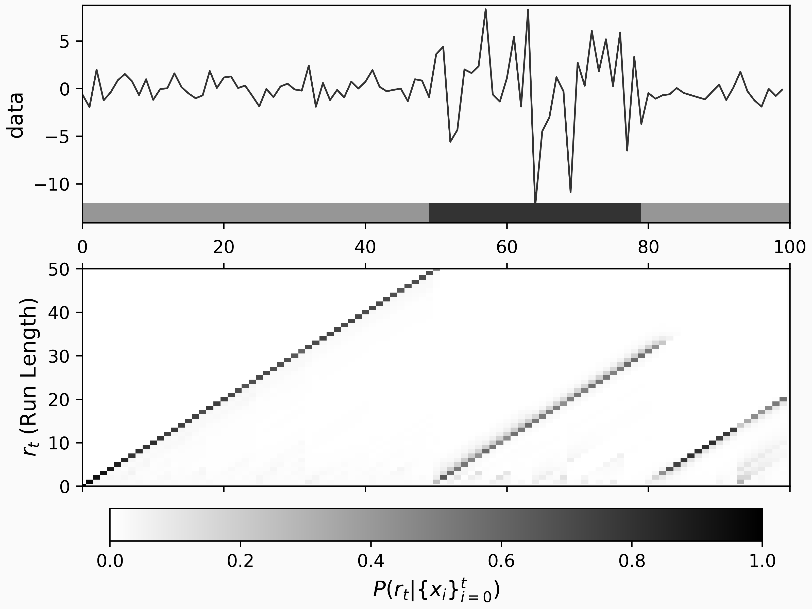

+++
title = "Introducing The changepoint Library"
date = 2023-09-28
template = "post.html"
draft = false

[taxonomies]
categories = ["data science", "ai"]

[extra]
author = "Michael T. Schmidt"
subheading = "Online changepoint detection for rust and python"
image = "maxim-hopman-fiXLQXAhCfk-unsplash.jpg"
image_attr = "Photo by Maxim Hopman on Unsplash"
theme = "light"
+++

## Where should I start
* [I don't know anything about Change Point Detection](#introduction)
* [I want to learn about Bayesian Online Change Point Detection](#bayesian-online-change-point-detector-bcpd) 
* [I want to learn about Auto Regressive Gaussian Process Change Point Detection](#autoregressive-gaussian-process-change-point-detector-argpcp)
* [I just want to learn about the changepoint software](#the-changepoint-library)

<br/>

## tl;dr
We have a new change point detection tool in Rust and Python.
Install them with `pip install changepoint` for Python or `cargo add changepoint` for Rust.

# Introduction 
Data streams, as time series, are ubiquitous, from stock prices to temperature sensors on your phone.
However, time series analysis can be confounded by changes in the data generation process.
For instance, the inertial sensor in a phone might show one kind of behavior white your phone sits on your nightstand and a completely different behavior when you walk to work.
The area of change point analysis seeks to split a time series into different regimes of behavior.
One common application is separating multiple speakers' voices from a single recording.
Each person speaks in their tone and speed, which can be split into different segments and analyzed further. 
Detecting changes in time series can also help you detect data or model drift, find a broken sensor before it misreports crucial data, or drive more profound insights into your data.

At Redpoll, we needed a tool to monitor for changes in data-feeds and model performance.
So, we created a change point detection library for Rust and Python called `changepoint`.


# The Changepoint Library

_If you just want to look at the libraries themselves, they can be found here:_
* Rust: [crates.io/crates/changepoint](https://crates.io/crates/changepoint)
* Python: [pypi.org/project/changepoint](https://pypi.org/project/changepoint/)


For this demo, we use the Python library which you can install with
```bash
python3 -m pip install changepoint
```

We have implemented two different methods of change point detection:
* Bayesian online Change Point Detection (or BCPD) [[1]]
* Autoregressive Gaussian Process Change Point Detection (or ARGPCP)) [[2]]

Both of these methods is suited for different types of change points.
First, let's discuss the BCPD detector.


## Bayesian online Change Point Detector - BCPD

Our first method is Bayesian Online Change Point Detection or BCPD.

The BCPD model tracks the statistical properties of each time step and it's predecessors.
For instance, at the \\(n\\)th time step, there would be \\(n\\) statistics stored.
So, when a new datum is observed, BCPD can determine if it likely came from a new distribution or one of the previous.

In more mathematical terms, as BCPD models data with a distribution over distributions, here called a prior, adding a new distribution at each point, then adapting each previous distribution with the new data.
As each new point in the time series is added to the detector, it can create a distribution of run lengths for the current regime.
If we call the datum at step \\(t\\), \\(x_t\\) and the run length at step \\(t\\), \\(r_t\\), then the model is as follows
\begin{align}
	P(r_t | x_1, x_2, \ldots, x_t) &\propto \sum_{r_t - 1} P(r_t | r_{t-1}) P(x_t | r_{t-1}, x_t^{(r)}) P(r_{t-1}, x_1, x_2, \ldots, x_{t-1})
\end{align}
where \\(x_t^{(r)}\\) is the data associated with the run \\(r_t\\), \\( P(r_t | r_{t-1}) \\) is the prior that the run length continues or resets, \\(P(x_t | r_{t-1}, x_t^{(r)})\\) is the likelihood the data belongs to the \\(r_t\\) run, and \\(P(r_{t-1}, x_1, x_2, \ldots, x_{t-1})\\) is the recursive term.
We implement our version with the \\(P(r_t | r_{t-1})\\) described with a geometric distribution with an expected run length \\(\lambda\\) before resets.
Do keep in mind, this model assumes the values of the time series are independent and identically distributed (i.i.d.) within each regime.

Let's see how this plays out with an example dataset.
```python
import numpy as np
from scipy.stats.distributions import norm

rng = np.random.default_rng(0x123)
dist_a = norm(0, 1)
dist_b = norm(1, 4)

n = 100
time_series = np.empty(n)

for i in range(n):
    if i >= 50 and i < 80 :
        time_series[i] = dist_b.rvs(random_state=rng)
    else:
        time_series[i] = dist_a.rvs(random_state=rng)
```

<figure>
    
    <figcaption>A random example timeseries.</figcaption>
</figure>


We can apply the BCPD model to our time series as follows:
```python
cpd = chp.Bocpd(
    prior=chp.NormalGamma(),
    lam=36,
)
change_point_history = np.zeros((n, n))
for i, x in enumerate(time_series):
    change_point_history[i, : i + 1] = cpd.step(x)
```
Where the `prior` is a `NormalGamma` which stipulates the time series segments should be normally distributed, and `lam` which specifies the characteristic run length of segments.
We can see the output of the model by using the tool `change_point_plot` found in the example notebook:

<figure>
    
    <figcaption>A random example timeseries with changepoint annotations from BOCP.</figcaption>
</figure>

This plot gives a summary of the change point results.
On the upper plot, we can see our time series and a bar added to the bottom which indicated regimes separated by the inferred change points.
In the lower plot, we can see the probability of different run-lengths over time.
The run-length probability plot shows us that our BCPD model is confident that there are three regimes; one from the start to the 50th time step, one from the 50th to around 80, and one more until the end.
Even with a fairly low number of data points, the statistical structure of the time series is clear. 

Now, let's move on to a more challenging example, the US Median Consumer Price Index [[4]].
Here, we can see the Median CPI from January 1948 to December 2022:

<figure>
    
    <figcaption>The US Median CPI from 1948 to 2022 from <a href="https://fred.stlouisfed.org/series/CPIAUCSL">FRED</a>.</figcaption>
</figure>

The Median CPI clearly has structure, e.g. periods of economic growth and contraction.
So, let's see if the BCPD model can capture these different regimes of behavior.

```python
import pandas as pd
import changepoint as cpd

data = pd.read_csv(
    "https://fred.stlouisfed.org/graph/fredgraph.csv?bgcolor=%23e1e9f0&chart_type=line&drp=0&fo=open%20sans&graph_bgcolor=%23ffffff&height=450&mode=fred&recession_bars=on&txtcolor=%23444444&ts=12&tts=12&width=748&nt=0&thu=0&trc=0&show_legend=yes&show_axis_titles=yes&show_tooltip=yes&id=CPIAUCSL&scale=left&cosd=1947-01-01&coed=2022-12-01&line_color=%234572a7&link_values=false&line_style=solid&mark_type=none&mw=3&lw=2&ost=-99999&oet=99999&mma=0&fml=a&fq=Monthly&fam=avg&fgst=lin&fgsnd=2020-02-01&line_index=1&transformation=pc1&vintage_date=2023-01-20&revision_date=2023-01-20&nd=1947-01-01",
    index_col="DATE",
)
cpi = data["CPIAUCSL_PC1"]

# Run the BCPD model
cpd = chp.Bocpd(
    prior=chp.NormalGamma(),
    lam=36,
)
n = len(cpi)
change_point_history = np.zeros((n, n))
for i, x in enumerate(cpi.values):
    change_point_history[i, : i + 1] = cpd.step(x)
```
and the results are plotted here:

<figure>
    
    <figcaption></figcaption>
</figure>

The following is a list of dates when BCPD predicts changes (i.e. the maximum a posteriori change points) after the year 2000:
```
...
2001-09
2004-04
2008-11
2009-10
2011-02
2012-04
2014-11
2015-11
2016-08
2020-03
2021-03
```

We can confirm there that the expected events are detected:

* 2020-03 - Covid Pandemic hits USA
* 2008-11 - TED Spread hits all-time max associated with the 2008 financial crisis
* 2001-09 - Economic fallout from 9/11

Not all of these change points have clear explanations, which could be due to a model mismatch (CPI might not be Normally distributed in each regime), or a more nuanced change that isn't as obvious.
Remember, the BCPD model predicts based on fittingness to a distribution, in this case, a standard normal distribution.

BCPD assumes each regime adheres to a distribution, e.g. Normal, Multivariate Normal, Poisson, or Bernoulli.
If our regimes have some dependence on past data, BCPD might give false positives.
To exemplify this, let's create a new time series with the following code

```python
n = 1000
data = np.exp(
    np.sin(2 * np.pi * np.linspace(0, 100, n) / 100)
) + 0.1 * np.random.normal(size=n)

cpd = chp.Bocpd(
    prior=chp.NormalGamma(),
    lam=10,
)

change_point_history = np.zeros((n, n))
for i, x in enumerate(data):
    change_point_history[i, : i + 1] = cpd.step(x)
```

<figure>
    
    <figcaption>A smootly varying timeseries with false positives from BCPD.</figcaption>
</figure>

In this figure, we can see BCPD yields spurious results for this time series since the i.i.d. assumption doesn't hold.
Instead of BCPD, we have the AutoRegressive Gaussian Process Change Point Detector for autocorrelated time series.


## AutoRegressive Gaussian Process Change Point detector - ARGPCP

The model for ARGPCP [[2]] uses an underlying Gaussian Process to model the time series, instead of BOCPD's Normal distribution, with the kernel \\(C R + \epsilon\\) where \\(C\\) is a constant, \\(R\\) is a radial basis function, and \\(\epsilon\\) is a white noise term.
In the same way as with BCPD, when the model underperforms on new data, we see a shift to a new regime. 

Let's take our smoothly varying example above and apply ARGPCP to it:
```python
argp = chp.ArgpCpd(logistic_hazard_h=-5, scale=1, noise_level=0.1, max_lag=10)
change_point_history = np.zeros((n + 1, n + 1))
xs = []
ys = []
for i, x in enumerate(data):
    cps = argp.step(x)
    change_point_history[i, : len(cps)] = cps
```
The parameters here are different from BCPD, but the docs have some helpful descriptions
```
Init signature:
chp.ArgpCpd(
    scale=0.5,
    length_scale=10,
    noise_level=0.01,
    max_lag=3,
    alpha0=2,
    beta0=1,
    logistic_hazard_h=-5,
    logistic_hazard_a=1,
    logistic_hazard_b=1,
)
Docstring:     
Autoregressive Gaussian Process Change Point detection

Based on Ryan Turner's [thesis](https://www.repository.cam.ac.uk/bitstream/handle/1810/242181/thesis.pdf?sequence=1&isAllowed=y).
```
The output of the ARGPCP model on this time series is:
<figure>
    
    <figcaption>A smootly varying timeseries with no false positives from ARGPCP.</figcaption>
</figure>

As we can see here, ARGPCP captures the autocorrelation we want for this kind of data.

But how does it perform on the simple time series data we saw first?
With default parameters, here's the output
<figure>
    
    <figcaption></figcaption>
</figure>
ARGPCP captures the broad behavior in this case but we can see it thinks the last few more extreeme values might signify a new regime.
In any case, it captures the behavior we want.

Quick aside, why would we want BCPD if ARGPCP does so well?
ARGPCP can "learn" that a time series has a low autoregressive dependence, however, if your time series is strictly i.i.d., then ARGPCP might falsely assume an autoregressive nature and miss a change point.
So, you have to choose which model fits your data the best.

Now, let's look at the US Median CPI data with ARGPCP:
```python
argp = chp.ArgpCpd(logistic_hazard_h=-2, scale=3, noise_level=0.01)
n = len(cpi)
change_point_history = np.zeros((n + 1, n + 1))
xs = []
ys = []
for i, x in enumerate(cpi.values):
    cps = argp.step(x)
    change_point_history[i, : len(cps)] = cps
```
which gives us
<figure>
    
    <figcaption>ARGP output for the Median CPI time series.</figcaption>
</figure>

In this case, the ARGPCP shows change points after 2000 occurring at the following dates:
```
2002-09
2003-03
2004-04
2005-06
2008-10
2008-11
2009-06
2009-09
2009-10
2010-05
2010-11
2012-07
2013-08
2014-12
2015-10
2020-02
2020-03
2021-01
```

Of note are the last few showing the economic changes caused by the pandemic and the financial aftermath's growing inflation.
The extracted dates are computed with the maximum a posteriori model, but a clearer picture emerges upon inspection of the run length probability plot in the lower figure.

# Conclusion
We can detect and analyze time series data using Bayesian change point detection (BCPD or ARGPCP).
This analysis can provide essential insights into the data.
Depending on your model assumptions, a specific model will provide more robust research, and each method discussed here is incredibly customizable.

# Examples
A notebook of examples can be found [here](https://github.com/promised-ai/changepoint/blob/master/pychangepoint/ChangePointExample.ipynb).

[1]: https://doi.org/10.48550/arXiv.0710.3742
[2]: https://www.repository.cam.ac.uk/bitstream/handle/1810/242181/thesis.pdf
[3]: https://doi.org/10.1007/s10115-016-0987-z
[4]: https://fred.stlouisfed.org/series/CPIAUCSL
