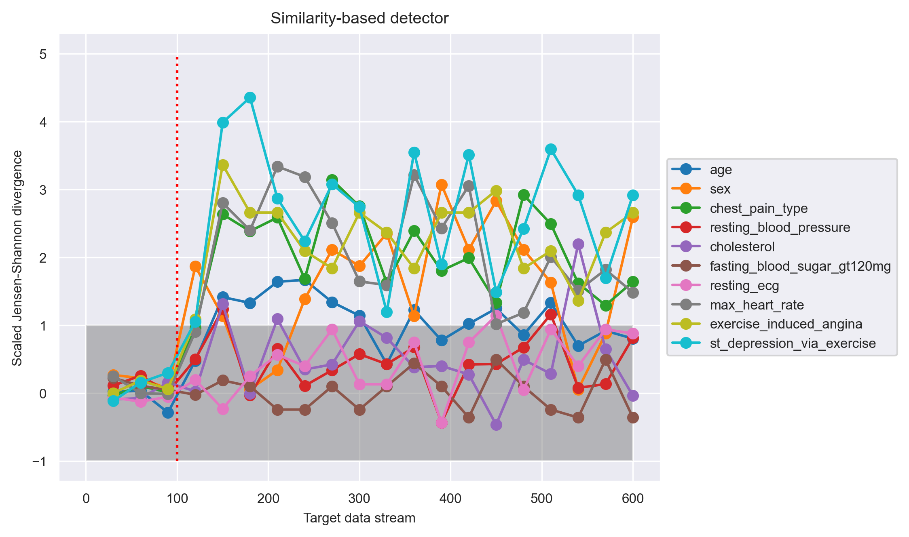
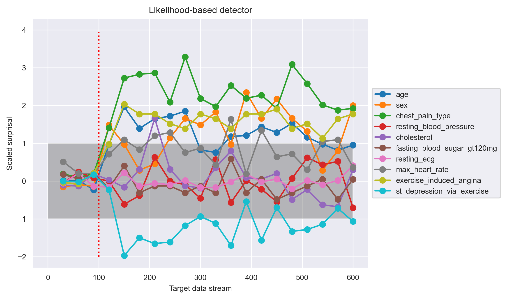
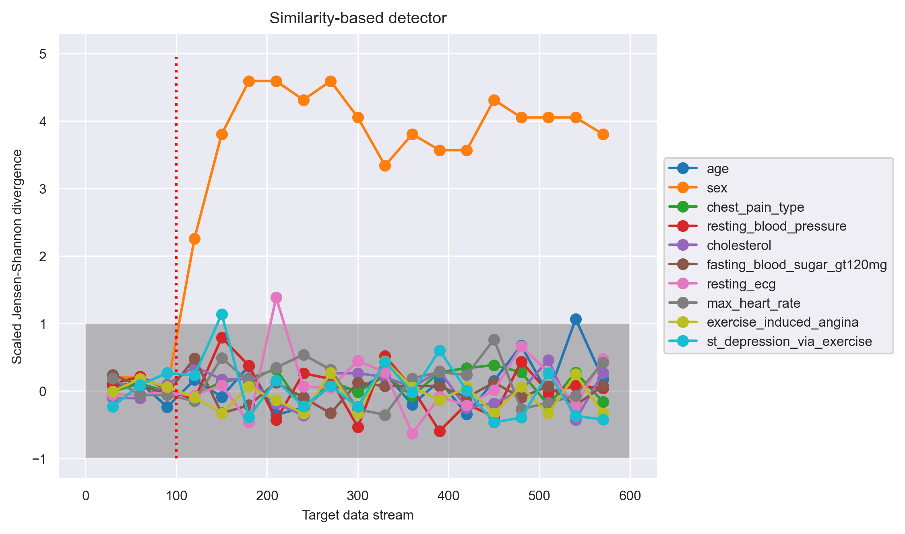
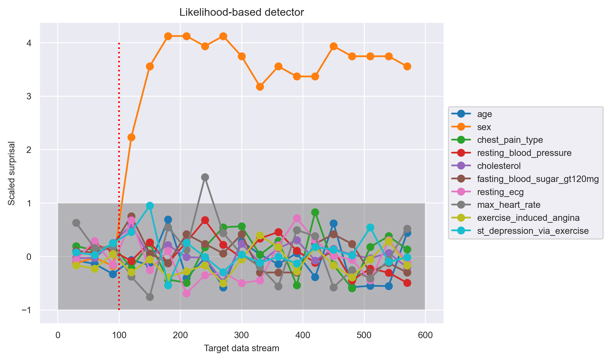
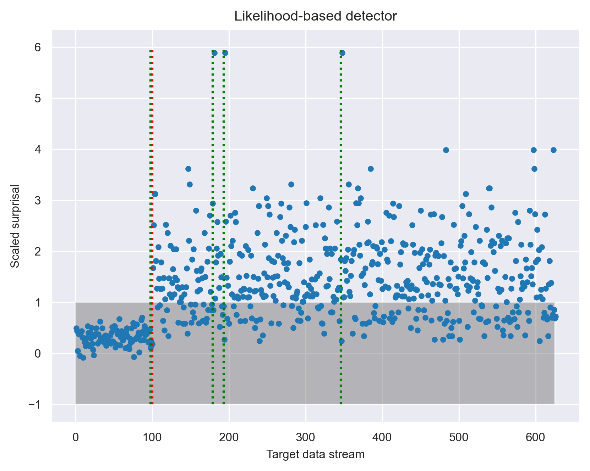
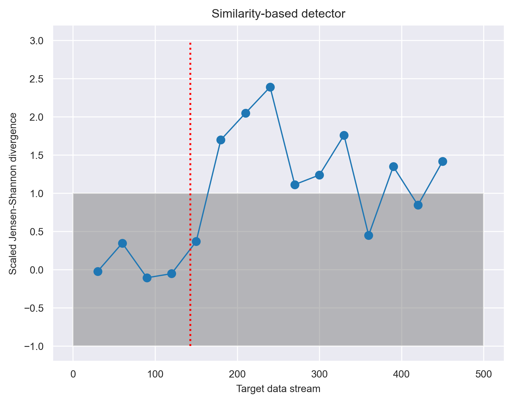
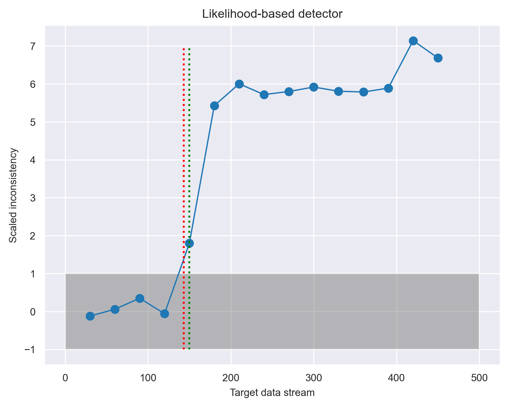

+++
title = "Likelihood based data drift detection"
date = 2023-11-06
template = "post.html"
draft = false

[taxonomies]
categories = ["ml", "data science"]

[extra]
author = "Scott Yang"
subheading = "Advantages of using a probabilistic model-based approach to monitor for systematic changes in incoming data"
image = "dolphins-1.jpeg"
+++

## Tl;dr
- Data drift occurs when the process generating data (the real world) changes over time, invalidating the assumptions implicit in the training data and thus invalidating the ML model
- Data drift is one of the most common failure modes of production AI/ML systems
- The most common approaches to data drift monitoring are based on similarity, which use model-free methods to compare the distribution of training data against new data
- We propose a likelihood-based method which uses a trained probabilistic model (built with [Lace](https://lace.dev)) to evaluate the likelihood of incoming data
- The likelihood-based approach covers all the use cases of the similarity-based approach while detecting gradual changes more quickly and allowing detection on a datum-by-datum basis rather than requiring a certain amount of post-training data accumulation

# What is data drift?

AI models are trained on data; thus, a model's behavior is tied to the distribution of its training data. Data drift pertains to a situation where the training-data distribution does not match the data distribution encountered in production. 

Data drift is one of the top failure modes in AI deployment. Whenever the production context or the data collection process changes, there is the potential hazard of data drift. For example, if one had trained a classifier to predict hospital admission rates based on patient information before 2019, the COVID-19 pandemic would drive a sizable data shift and likely cause the classifier to produce wrong predictions. Moreover, data drift is subtle: it does not break the model but makes the model produce wrong answers. Consequently, all down-stream processes that depend on the model's outputs are polluted.

# How to detect data drift?

Approaches to detect data drift roughly fall into two camps: "similarity-based" and "likelihood-based."

The similarity-based approach first constructs a reference distribution and a target distribution from the training data and data encountered in production, respectively, and then computes how (dis)similar the two distributions are. This approach is usually done feature by feature, because constructing model-free distribution on more than a couple dimensions often requires an intractable number of samples. 

The likelihood-based approach first builds a reference density model of the entire training data, and then as the target data encountered in production stream in, one evaluates the likelihood of the data under the reference density model. This is a nascent but rapidly growing approach typically used for high-dimensional, unstructured data such as images and texts, thanks for the recent development in generative AI.

[Lace](https://lace.dev), our Bayesian nonparametric inference engine, can build density models of tabular data, thus enabling a likelihood-based data drift detection for structured data. Below we investigate the likelihood-based approaches and compare it with the similarity-based approach.

# Building unsupervised drift detectors: similarity-based and likelihood-based

In most cases of deployment, the data stream coming in does not have a corresponding label stream. Thus, the most common type of data drift detector is unsupervised, that is, the detection does not involve the model predictions but depends purely on the features of the data.

Let's go through the steps for building a similarity-based drift detector. First, form a reference distribution for each feature in the training data. If the feature is numeric, one typically forms a probability density function using kernel density estimation. If the feature is categorical, one can use the empirical probability mass function over the categories. Second, as the target data stream comes in, choose how many data points to accumulate. Form a target distribution for each feature in the accumulated target data in the same manner. Third, compute a (dis)similarity measure between the reference distribution and target distribution; a common measure is the Jensen-Shannon divergence. Fourth, decide on a threshold. When the dissimilarity measure is above the threshold, the detector sounds an alarm to signal drift detection. A self-referential way to set the threshold is to look at the typical level and fluctuations of dissimilarity between the reference distribution and itself. If (target dissimilarity - self dissimilarity) > β * fluctuations (with β = 3 for example), there is likely a drift.

Following the same framework as above, let's go through the steps for building a likelihood-based drift detector. First, build a reference distribution model of the training data. Lace does this by using Bayesian nonparametrics. We will leave how this compares to deep-learning methods for tabular data modeling to another time, but as it stands now, deep-learning techniques have a hard time capturing all the structure of tabular data. Second, stream the target data into the reference distribution model and ask the model to output the likelihood that the target data are samples from the reference distribution. Third, decide on a threshold. Again, we can use the self-referential approach to capture the typical value and fluctuations of the likelihood by streaming the training data into the reference distribution. 

What do we get out of paying the price to build a model of the training data? One benefit is that the likelihood-based approach can process target data stream datum by datum. Another benefit is that  likelihoods can be computed feature by feature, on any groupings of features, or even on features conditioned on other features. In comparison, the similarity-based approach requires an accumulation of enough target data to produce sensible similarity measures. Of course, the potential down side of the likelihood-based approach is that the usefulness of the likelihoods depends on how well the model captures the training data.

# Evaluating the drift detectors

To evaluate the drift detectors, we simulate data drift so that we know the ground truth of when the shift occurs, and check to see if the detectors pick up the drift as expected. The general idea of the simulation is to create two datasets: a training set and a test set. The test set concatenates two chunks of data: a first chunk that shares the same characteristics as the training set, and a second chunk with different characteristics. After the detectors are trained on the training set, we stream the test set into the detectors to simulate the target data encountered in production. We then evaluate whether the detectors can pick up when the chunk with different characteristics is streamed in.

We use a heart disease dataset with 10 feature variables and 1 label variable (heart_disease_diagnosis). To ensure we have data chunks with different characteristics, we split the heart disease data by whether heart_disease_diagnosis is 0 or 1, forming a "healthy" chunk and an "ill" chunk. Moreover, we make a copy of the normal chunk, and change one of the features (e.g., by flipping a binary feature's value) to simulate unexpected corruptions during the data collection process. Now we have three types of data: healthy, ill, and corrupted. Finally, we drop the label variable from the data to simulate the scenario of unsupervised drift detection.

Equipped with these different types of data, we now construct two scenarios of data drift. (1) Context Drift: The training set is sampled from the healthy data, and the two chunks of the test set are sampled from the healthy and ill data, respectively. All sampling is done without replacement. If the detectors work, they should pick up when the ill data are streamed in. Remember that the detectors do not have access to the healthy-ill label. (2) Single-feature drift: the training set and the first chunk of the test set is sampled as in scenario 1, but the second chunk of the test set is sampled from the corrupted data. 

Note that both scenarios include a no-drift phase provided by the first chunk of the test data. A good detector should be silent when there is no drift.

## Scenario 1: Context drift

Shown in the above graph is the evaluation for the similarity-based detector. The x-axis shows the target data stream in units of number of points. The target data accumulation is for 30 data points, so the detector outputs a dissimilarity measure every 30 points, as indicated by the circle markers. The red vertical dotted line shows the ground truth of data drift onset, which is at the 100th data point. 

The y-axis shows the scaled JS divergence, which is computed by (target dissimilarity - average self dissimilarity) / (3 * self fluctuations). A scaled JS divergence that is greater than 1 indicates that the target dissimilarity is well above the normal range of dissimilarity observed when there is no data drift. Thus, we can see that this detector picked up the drift right after the actual drift onset, by showing that the scaled JS divergences for many of the features are clearly greater than 1 from point 150 onward.

Shown in the above graph is the evaluation for the likelihood-based detector. The x-axis, target data accumulation, and the red vertical line are the same as above. The y-axis shows the scaled surprisal. Surprisal is simply the negative log likelihood, a measure of how surprising (unlikely) it is to get the target data from the reference model.  The scaling of the surprisal is again computed by (target surprisal - average self surprisal) / (3 * self fluctuations). We see that this detector picked up the drift confidently around point 150, on and after which the scaled surprisal for some of the features are consistently greater than 1. 

## Scenario 2: Single-feature drift

In this scenario, the "sex" feature in the second chunk of the test set is corrupted beginning from the 100th point. The similarity-based detector picked up this feature drift right after the drift onset.

Likewise, the likelihood-based detector also picked up the feature drift right after shift onset.

Overall, both detectors are able to pick up the actual drift onset! For scenarios 2, the two are equally good. For scenario 1, the similarity-based detector may have an edge over the the likelihood-based one, as the former is able to detect the drift onset perhaps more confidently (more feature drifts with larger magnitudes).  However, as alluded to before, the likelihood-based detector really shines for datum-by-datum processing on multiple features at once. Let's see what this scenario looks like.

## Scenario 3: Datum stream

In this experiment, we will repeat scenario 1, but with the constraint of no target data accumulation. The similarity-based detector cannot produce sensible outputs in this case, because there is no sensible way to approximate a data distribution from a single datum. 

To increase the detection power in this challenging case, we allow the likelihood-based detector to calculate the likelihood of all the features at once, but still one datum at a time. The result is shown in the following figure:

The ground truth onset of data drift is again shown by the red vertical line at data stream point 100. The figure shows that simple thresholding does not work well in this scenario because of the large overlap in the distributions of the scaled surprisal before and after drift onset. Nevertheless, it is clear that the distribution did change after the drift onset. To identify this change, we used a change-point-detection method ([see our changepoint library](https://redpoll.ai/blog/changepoint/)) in place of simple thresholding. The result of a Bayesian change-point detector identified changes in four places as shown by the green vertical lines. In addition to capturing the actual onset of data drift, the change-point detector also noticed three instances of outliers, which are likely worth investigating when monitoring the model.

This proof-of-concept experiment shows that the likelihood-based approach can indeed detect data drift by processing target stream datum by datum! The detection requires the help of a change-point detector, which is more complex than thresholding and comes with its own implicit data accumulation scheme. Nevertheless, the likelihood-based approach can do everything that a similarity-based approach can do and offers the additional capability of datum-by-datum processing and a principled way to combine the contribution of any set of features.

# Scenario 4: Subtle change

Another advantage of the likelihood-based approach is that it offers a principled way to combine the likelihood of all the features. As long as the model captures the dependencies among the features, the likelihood also will; this is not the case for similarity-based approach. Consequently, we expect the likelihood-based approach to have higher sensitivity (higher statistical power) in detecting subtle data drift.

To test this idea, we conduct another experiment similar to Scenario 1, but with the following three changes. First, instead of splitting the data by the heart_disease_diagnosis feature, we split the data by the sex feature, producing a training data with one gender, and the test data with that gender in the first chunk and the other gender in the second chunk. The drift onset based on change in gender occurs at point 143. We expect a change in gender to produce a more subtle drift than a change in heart_disease_diagnosis, because having heart disease is not specific to a particular gender. Second, we strengthen the detection power of the similarity-based method by summing up the JS divergence over all the features to produce one master JS divergence. Lastly, we tested another quantity that the likelihood-based method offers called inconsistency. Inconsistency is defined as the surprisal over all features (hence, incorporates the dependencies among the features) divided by the sum of the surprisal of each individual feature. Intuitively, inconsistency highlights changes in dependencies among the features.

Here are the results:

Comparing the the two approaches, we see that the inconsistency measure provides a more pronounced and steady signal than the JS divergence. A Bayesian change point detector identifies the shift to be at point 150 (green vertical line), which is close to the actual shift onset at 143 (red vertical line).

# What happens after data drift is detected?

Detection of data drift suggests that the AI model is out of context and needs to be updated. Current practices mainly involve retraining the model with the newly collected data and redeploying it. Retraining and redeployment are not the most ideal solution because they are time-consuming and labor-intensive. The more ideal solution is if the AI model could continually update itself and adjust to the changing environment. How to do this is another post, but [Lace](https://lace.dev) allows such continual learning. So, stay tuned!

