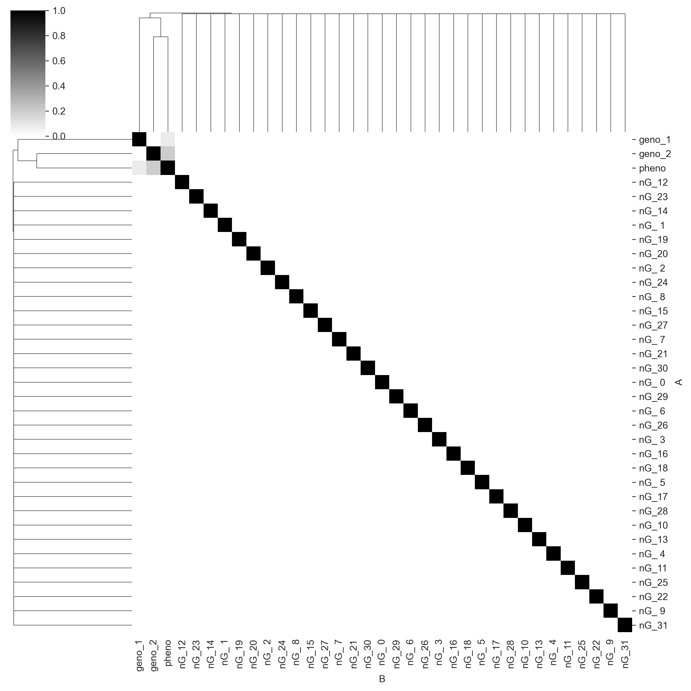
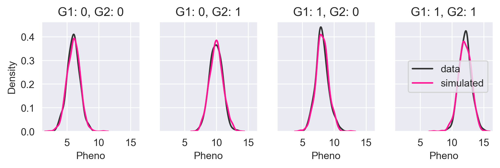
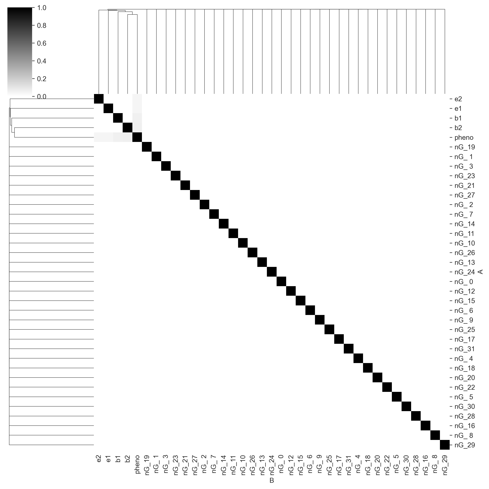
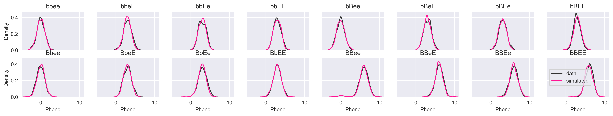
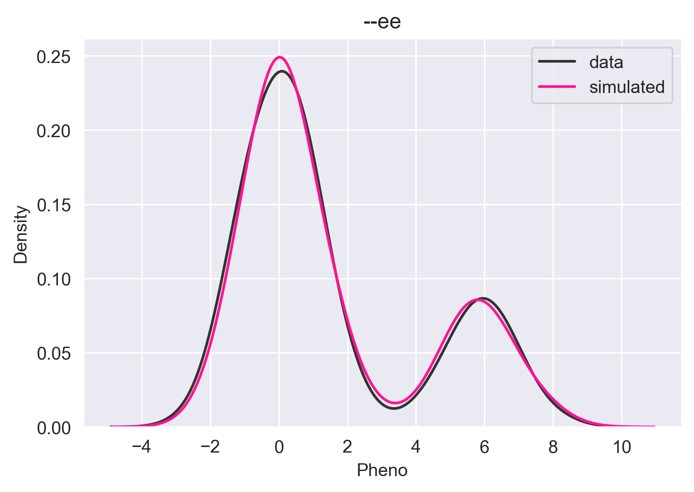
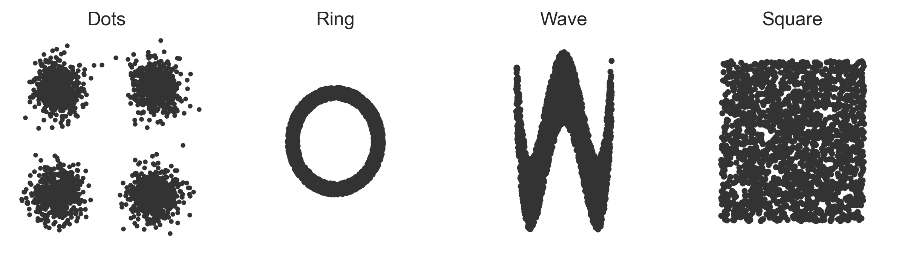
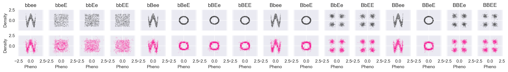
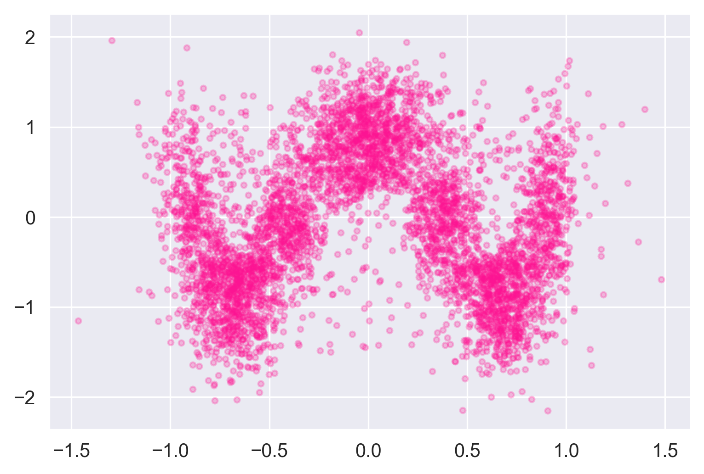

+++
title = "Epistasis is easy"
date = 2021-04-29
template = "post.html"
draft = false

[taxonomies]
categories = ["ai", "genomics"]

[extra]
author = "Baxter Eaves"
subheading = "Nonlinearity can be understood simply... with the right tools"
image = "yellow-lab-lights.jpg"
theme = "light-transparent"
front_page = false
+++

<!-- Genomic data are expensive to generate: it takes time, facilities, and care to raise a bacterium, a plant, a cow; a person. Genomic data are expensive to collect: a full sequence is round about [$1000](https://www.genome.gov/about-genomics/fact-sheets/Sequencing-Human-Genome-cost#:~:text=Based%20on%20the%20data%20collected,sequence%20was%20generally%20below%20%241%2C000.). Genomic data are massive: a human genome contains 3 billion base pairs. Presumably there is a reason we go through the considerable trouble and expense of generating, collecting, and storing these data. -->

One of the reasons we collect genomic data is for modeling and prediction. If we sequence a set of corn plants then grow them, we know the genetics (*genotype*) of the plants and we know what they look like when they're grown (*phenotype*). With this information, we may be able train a machine to predict phenotypes from the genotype. Doing so would allow us to sequence next year's seeds and determine which ones to grow by assessing predicted performance.

The realities of genomic data, however, are problematic. Genomic data are **wide**. For any complex organism, our data have an unwieldy number of features (thousands or millions) and not many rows (thousands or tens of thousands) because genomic data are expensive and time-consuming to collect. Also, the data (*single-nucleotide polymorphism*, or *SNP*s) composing the sequence are categorical &mdash; often taking on the values {0, 1, 2} or {-1, 0, 1}. The encoding required to make them usable as inputs in most machine learning models only further **increases** the number of features.

The data limits the choices of capable models. The sheer number of features and low number of samples rule out expressive, high-parameter, data-hungry models like deep neural networks. As a result, the workhorse of this type of modeling is the **general linear model (GLM)**. GLMs make a lot of strong assumptions about the data, so it mercifully requires fewer data to function. Modelers usually provide GLM with the unencoded genomic data as input and a single phenotype as output. And this does as well as anything else.

> **The problem with the use of GLM here is that it fundamentally wrong. The genotype-to-phenotype relationship is often *non-linear*.**
>
> **One such non-linearity is [epistasis](https://en.wikipedia.org/wiki/Epistasis).**

In epistasis, *the effect of a gene is modulated by another modifier gene*. Labrador retriever coat color is a textbook example of epistasis.

Here we'll walk through a series of modeling scenarios and seed how **Redpoll Core** handles non-linear relationships.

# Experiments

We will generate data in three progressively more difficult scenarios. In each experiment, we will perform the same three tasks:

1. Generate a set of random, independent *alleles*
1. Define a (non-linear) relationship between the alleles and a phenotype
1. Generate the phenotype from the alleles given that relationship

To show the performance of our core platform in understanding the process that generated the data, we will primarily use two methods: **structure learning** and **simulation**. 

* **Structure learning** is a technique used to learn the statistical structure of data, that is to learn which variables affect which other variables and how. We will ask the Core platform which alleles affect the phenotype and to what degree.
* With **simulation**, we can output phenotypes given different input alleles. If the simulated data look like the observed data, the model has done a good job of capturing the data.

You might note that we will not be using train / holdout prediction paradigm. This is because the goal should be understanding; accurately capturing the process that created the data. Prediction is an treacherous goal, beset on all sides by confounding factors. We never have enough data to predict with perfect certainty, and we should first understand what our uncertainty is and how much of what data we might need to reduce our uncertainty to an acceptable value.

To emphasize this point, we could grow the exact same plant in two different environments and get two **very** different outputs. Tomatoes grown in central valley California are likely to outperform ones planted in southeastern Alaska. Heck, even plants cultivated in the *same field* perform wildly differently depending on wind, slope, water pooling, etc. It's valuable to capture that variance, not just choose one most likely value.

# Easy: linear interaction

We will begin with a linear relationship between alleles and phenotype. There are two alleles and one phenotype. In python code the data are generated like this:

```python
geno_1 = np.random.randint(2, size=n) + 1
geno_2 = np.random.randint(2, size=n) + 1
pheno = np.random.randn(n) + geno_1*2  + geno_2*4
```

In the above code, more of allele means more of phenotype, plus some random Gaussian noise. Then we add 32 extra noise alleles that do not affect the phenotype just to make things more difficult. We save all that into a csv and throw it to Core. This will be the general work flow we use throughout.

```python
import redpoll as rp

# Trains the redpoll core platform on `csv_filename` and saves the
# result to `metadata_path`
rp.funcs.run(metadata_path, csv=csv_filename)

# Starts a http server to a Core instance
rp.funcs.server(metdata_path)

# Connects to the Core server
c = rp.Client('localhost:8000', secure=False)
```

We will omit the above steps in the following experiments. The first thing we will do is see whether Core has discovered the correct causal structure of the data. We will generate a mutual information matrix. Each cell in the matrix is the amount of shared information (scaled to the interval [0, 1]) between each pair of variables. One (black) means that both of the variables are perfectly predictive of each other, zero (white) means the variables are completely independent.

```python
c.heatmap('mi', cmap='gray_r', vmin=0, vmax=1);
```



We can see that Core captures the correct causal structure. `pheno_1` and `pheno_2` share information with `pheno`, but do not share information with each other. `geno_2` seems to have more information for `pheno` than `geno_1` does, which is perhaps because the linear constant on `geno_2` is higher. We also see that Core correctly identifies all the noise genotype columns (prefixed with `nG_`) as having no shared information with any other variables. Given sequence data, this sort of statistical mapping could be used for QTL mapping.

Now we will simulate the phenotype give the genotype. We can use the following command:

```python
xs = c.simulate(['pheno'], given={"geno_1": g1, "geno_2": g2}, n=1000)
```

Note that we do not need to condition (using `given`) on all 34 genotype columns in the data set. We know from the mutual information matrix that only two alleles predict `pheno`, so we only need to condition on those two columns. 

Let's simulate the phenotypes for all four possible permutations of alleles and compare the core simulated output with the input data.



In the above figure, we see the KDE of the input data in black and the KDE of the Core simulated data in pink. The KDEs are nearly identical meaning that Core has done a good job of capturing the probability distribution.

But we knew this would be easy. We already said that GLM can do this. Things look a little different in GLM though. GLM does not do structure learning, but instead relies on users to manually analyze the model parameters to identify the important inputs. And since most GLM software is designed singly with regression in mind, it requires extra work from the user to do simulation.

> **The goal should be understanding; accurately capturing the process that created the data.**

# Medium: nonlinear univariate trait

Now we will look at a simple example of epistasis. Above we mentioned that Labrador Retriever coat color was an nonlinear trait. Let's do something like that. We will generate new data. Everything will be the same except we'll have four genotypes instead of two, and we will have a different function that generates the phenotype from the genotypes.

```python
b1s = np.random.randint(2, size=n)
b2s = np.random.randint(2, size=n)
e1s = np.random.randint(2, size=n)
e2s = np.random.randint(2, size=n)


def color(b1, b2, e1, e2):
    """
    Parameters
    ----------
    b1, b2: int {0, 1}
        The 'b' alleles. Can either be 0 (b) or 1 (B)
    e1, e2: int {0, 1}
        The 'e' alleles. Can either be 0 (e) or 1 (E)

    Returns
    -------
    (str, float): The coat type label and the pigment value
    """
    if b1 == 1 and b2 == 1:
        # BB-- is a black lab
        return 'black', 6
    elif e1 == 0 and e2 == 0:
        # --ee is a yellow lab
        return 'yellow', 0
    else:
        # Chocolate lab
        return 'chocolate', 3
```

The `color` function above generates the mean of the pigment distribution. More pigment implies a darker coat. Again, we will add Gaussian noise to the phenotype. And again, we will throw everything to Core and output a mutual information matrix.



Again, Core has found the correct causal structure, with the columns `b1`, `b2`, `e1`, and `e2` all sharing information with `pheno` and not with each other.

Let's simulate `pheno` given all possible allele permutations and see how we do.



If the image is too small, you can click the image for lightbox view. The simulated data look just like the input data. Let's try a more subtle simulation that demonstrates why we might not want to use a model that gives us a single prediction rather than a distribution. What happens if we simulate `pheno` given the genotype "--ee"?

```python
xs_ee = df_med[(df_med.e1 == 0) & (df_med.e2 == 0)].pheno
sim_ee = c.simulate(["pheno"], given={'e1': 0, 'e2': 0}, n=1000)

sns.distplot(xs_ee, color="#333333", hist=False, label="data")       
sns.distplot(sim_ee.pheno, color="deeppink", hist=False, label="simulated")
plt.legend(loc=0)
plt.title("--ee") 
plt.xlabel("Pheno")
```



It is a multimodal distribution. There are four ways to get the `--ee` genotype that will hit two of the three branches in the `color` function. If we have `BBee`, we have a black coat; `Bbee`, `bBee`, and `bbee`, give us a yellow coat. A regression model might say "The phenotype given `--ee` is 0.0" and you'll have to accept that. Some regression models might choose the mean instead of the global max, which would put your prediction in the trough of the distribution, which would be completely wrong. Core allows you to visualize the conditional/predictive distribution so you can make the best decision taking the uncertainty into consideration.


# Hard: nonlinear multivariate non-linear trait

Let's try something totally off-the-wall. We will have a bi-variate phenotype where the alleles determine the distribution of the phenotype, but let's have the phenotype distributions themselves be nonlinear zero-correlation distributions: four dots, a sine wave, a square, and a ring. The phenotype-generating function looks like this:

```python
def xy(b1, b2, e1, e2):
    if b1 == 1 and e1 == 1:
        # BB-- comes from dots
        return 'dots', gendots()
    elif e1 == 0 and e2 == 0:
        # --ee comes from wave
        return 'wave', genwave()
    elif b1 == 0 and b2 == 0:
        # bb-- comes from square
        return "square", gensquare()
    else:
        # everything else comes from a ring
        return 'ring', genring()


b1s = np.random.randint(2, size=n)
b2s = np.random.randint(2, size=n)
e1s = np.random.randint(2, size=n)
e2s = np.random.randint(2, size=n)

data = {
    "b1": b1s,
    "b2": b2s,
    "e1": e1s,
    "e2": e2s,
    "pheno_x": [],
    "pheno_y": [],
}

for b1, b2, e1, e2 in zip(b1s, b2s, e1s, e2s):
    _, (x, y) = xy(b1, b2, e1, e2)
    data["pheno_x"].append(x)
    data["pheno_y"].append(y)
```

The phenotype distributions for each shape look like this (all axes are scaled identically):



The `x` and `y` dimensions of the phenotypes aren't really even predictable now because the phenotype distributions aren't really even functions anymore. For any `x` value there are multiple possible `y` values and for any `y` value there are multiple possible `x` values.

First, we will compare the data against the simulated values from Core:



Again, black is the data, and pink is simulated. We're recovering things pretty well. Let's try a partially-conditioned simulation from the "wave" path of the `xy` function above. To do so, we simulate the phenotype given `--ee`:


```python
b = 0; B = 1; e = 0; E = 1;
xys = c.simulate(["pheno_x", "pheno_y"], given={'e1': e, 'e2': e}, n=5000)
plt.scatter(xys.pheno_x, xys.pheno_y, color='deeppink', alpha=0.25, s=8)
plt.xlabel("pheno_x")
plt.ylabel("pheno_y")
```



A little noisier than the input, but it definitely looks like a wave.

# Wrap up

The monetary and time costs of generating and collecting genomic and phenomic data place constraints on genomic modelers. The fewer data we have, the less learning we can do. The more features we have, the more learning &mdash; and more data &mdash; are required. Given these constraints, genomic modelers have generally converged on general linear models (GLM), which make more of less data by making a strong linearity assumption. The key problem being that the linearity assumption is wrong.

Epistasis is a common non-linear relationship between multiple genes and a phenotype. 

Over three simulation experiments, we showed how the Redpoll Core platform can capture both linear and non-linear statistical distributions. Core can map the causal structure of data, capture the probability distributions of complex nonlinear data, and can help users to visualize the uncertainty in predictions through the use of conditional distributions.

# Key points

- The data we have to do genotype -> phenotype modeling are often short and wide, so we cannot use data hungry models, so the workhorse of genotype -> phenotype modeling is general linear models (GLM).
    + GLM makes strong assumptions about the data that allow it to learn from fewer data
    + But we know that the linearity assumption of GLM is wrong in genetics.
    + Epistasis is a common nonlinear genetic phenomenon.
- Regression models can fail to predict correctly in non-linear data because the predictive distributions may be multi-modal.
    + Modeling the statistical distribution of the data is safer and more useful than regression
- The Redpoll Core platform can
    + Map the statistical structure of data
    + Capture non-linear statistical distributions
    + Handle joint probability distributions of mixed-type data (e.g. categorical alleles and continuous phenotypes)
    + Quantify uncertainty arising from noisy and small data

