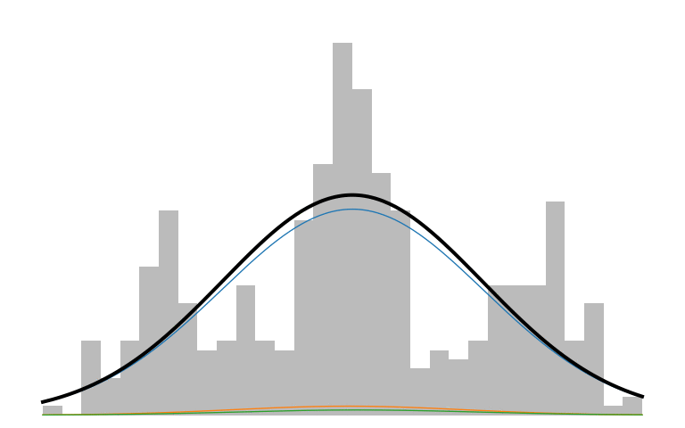

+++
title = "Tutorial: Infinite Mixture Model in Rust with rv 0.12"
date = 2021-05-19
template = "post.html"
draft = false

[taxonomies]
categories = ["ml", "tutorial"]

[extra]
author = "Baxter Eaves"
subheading = "Building a supremely useful model in a supremely useful programming language."
image = "clouds-01.jpg"
theme = "dark-transparent"
front_page = true
+++

The Infinite mixture model is one of our favorite statistical models. It approximates arbitrary probability distributions using a non-parametric Mixture model. It can be used for regression, classification, and clustering. Additionally, rust is our favorite programming language. It is performant, safe, and fun.

In this post we'll walk through the infinite mixture model at a high level and implement one in Rust using the `rv` crate.

# The rv crate
[RV](https://crates.io/crates/rv) is a statistical toolbox for the Rust programming language designed for our work in probabilistic AI and machine learning. It provides a number of probability distributions given functionality through traits.

For example, let say that that we wanted to infer the weight of an unfair coin given a number of observed coin flips:

```rust
use rv::prelude::*;

let obs: Vec<u8> = vec![0, 1, 0, 1, 1, 0, 1];
```

Here we've used `u8` for binary data because `0` is quicker to type than `false` &mdash; but we could use `bool` if we wanted to. Next we set up a prior for our coin weight. The usual choice for a variable in [0,1] is the beta distribution.

```rust
let prior = Beta::uniform();
```

Now we load the data into a structure that allows certain distributions to compress the data into a few summary statistics.

```rust
let data: BernoulliData<_> = DataOrSuffStat::Data(&obs);
```

Then we generate the posterior distribution of the parameter given the data.

```rust
let posterior = prior.posterior(&data);
```

That's it.

Now we can do things like compute the posterior PDF over a number of coin weights:

```rust
let coin_weights: Vec<f64> = vec![0.01, 0.25, 0.5, 0.75, 0.99];
coin_weights.iter().for_each(|w| {
    let p = posterior.pdf(w);
    println!("f(w={}|x) = {}", w, p);
})
```

Which outputs:

```
f(w=0.01|x) = 0.000002716837199999992
f(w=0.25|x) = 0.4614257812499989
f(w=0.5|x) = 2.1874999999999942
f(w=0.75|x) = 1.3842773437499958
f(w=0.99|x) = 0.00026896688279999943
```

# Infinite Mixture Models
The Infinite Mixture Model (IMM) is a Bayesian non-parametric approach to estimating a mixture distribution with an unknown number of components. That's a lot of jargon. More simply, you can think of the IMM as a clustering algorithm that also learns the number of clusters. Given a data set with n data, there could be as few as 1 category and as many as n. Because we're Bayesian, the IMM puts a prior belief on the process that assigns data to categories. 

The generative process of and IMM looks like this:

<p>
\[z \sim CRP(\alpha) \]
\[ \theta_k \sim \pi(\theta)\, \text{for}\, k \in 1,\dots, \text{max}(z) \]
\[ x_i \sim f(x|\theta_{z_i}) \]
</p>

where \\(CRP(\alpha)\\) is the [Chinese Restaurant Process](#) with discount parameter \\(\alpha\\). Note that CRP is not your only choice for this process, but it is the most common. \\(z\\) is an n-length list where each entry, \\(z_i\\) is an integer indicating to which component datum \\(x_i\\) is assigned; and \\(\theta_k\\) is the parameters component \\(k\\). So, we draw an assignment from CRP, draw a set of parameters for each component, then draw data from their assigned components.

Here is what an IMM looks like in action:



The prior initializes to a unimodal model that encompasses all the data. As inference runs, it picks up on the multi-modality of the data and creates new components to capture those modes. The IMM is in a constant battle to balance model simplicity with data explainability.

We're going to need a few things to make the IMM a reality:
- A likelihood model \\(f(x|\theta)\\)
- A prior on that likelihood model, \\(\pi(\theta)\\)
- A CRP

For simplicity, we'll assume our data are univariate continuous, so we'll model them as a Gaussian mixture model. Each component will be a Gaussian distribution, which means that \\(\theta = (\mu, \sigma)\\), where \\(\mu\\) is the mean of our Gaussian distribution and \\(\sigma\\) is the standard deviation.

For our prior, we'll choose a Gaussian prior on \\(\mu\\) and a Inverse Gamma prior on \\(\sigma^2\\). This is not an arbitrary choice. This Normal, Inverse-Gamma prior is conjugate, which will make our lives much easier when we go to write the inference algorithm.

Let's start by writing some code. Here is our IMM struct:

```rust
struct Imm {
    // The data
    xs: Vec<f64>,
    // The prior on the partition of data
    crp: Crp,
    // The current partition
    partition: Partition,
    // Keeps track of the data IDs as they're removed and replaced
    ixs: Vec<usize>,
    // The Prior on each of the components.
    prior: Arc<NormalInvGamma>,
    // A vector of component models with conjugate priors
    components: Vec<ConjugateModel<f64, Gaussian, NormalInvGamma>>,
}
```

We have a container for our data, `xs`; a Chinese Restaurant Process, `crp`; a partition for our data; `partition`; a bookkeeping structure to retain the order of data as they are moved in and out of the partition, `ixs`; a prior for our component models, `prior`; and a vector of our component models, `components`.

To see how these things all work together, let's write a constructor that draws an `Imm` from the prior:

```rust
use std::sync::Arc;
use rand::Rng;
use rv::ConjugateModel;
use rv::data::Partition;
use rv::dist::{Gaussian, Crp, NormalInvGamma};
use rv::misc::ln_pflip;
use rv::traits::*;

impl Imm {
    fn new<R: Rng>(
        xs: Vec<f64>,
        prior: NormalInvGamma,
        alpha: f64,
        rng: &mut R
    ) -> Self {
        let n = xs.len();

        // Create the partition prior
        let crp = Crp::new(alpha, n).expect("Invalid params");

        // Initial partition drawn from the prior
        let partition = crp.draw(rng);

        // Put the prior in a reference counter
        let prior_arc = Arc::new(prior);

        // Create an empty component for each partition. Drawing component
        // models is used as a template; The parameters don't matter because we
        // will marginalize them away through the magic of conjugate priors.
        let mut components: Vec<_> = (0..partition.k())
            .map(|_| {
                ConjugateModel::new(&prior_arc.draw(rng), prior_arc.clone())
            })
            .collect();

        // Given the data to their respective components by having them observe
        // their data.
        xs.iter()
            .zip(partition.z().iter())
            .for_each(|(xi, &zi)| components[zi].observe(xi));

        Dpmm {
            xs,
            ixs: (0..n).collect(),
            crp,
            partition,
            prior: prior_arc,
            components,
        }
    }
// ... 
```

We have an `Imm` drawn from the prior, now we have to do posterior inference. To do that, we're going to use the *collapsed Gibbs sampler* which exploits the conjugacy to ignore (collapse) component parameter inference. The MCMC algorithm is simple

1. Initialize from prior
2. Choose a random datum \\(x_i\\)
3. Remove \\(x_i\\) from the partition
4. Re-insert \\(x_i\\) into component \\(z_i\\) according to

$$
    p(z_i = k) \propto 
    \begin{cases}
        n_{k/i} \\, p(x_i | \\{x_j : z_j = k\\})&\\; \text{if k exists} \\\\
        \alpha \\, p(x_i)&\\; \text{otherwise} \\\\
    \end{cases},
$$

where \\(n_{k/i}\\) is the number of data assigned to component \\(k\\) less \\(x_i\\).

We assign \\(x_i\\) to an existing component with probability proportional to the number of data assigned to that component times the posterior predictive probability of \\(x_i\\) given the data assigned to that component; and we assign \\(x_i\\) to a new component to a new, singleton, component with probability proportional to \\(\alpha\\) times the marginal likelihood of \\(x_i\\). We can compute the marginal likelihood and the posterior predictive directly because we have chosen a likelihood and a prior that allows us to do so.

To make inference work, we need two more functions: remove and insert.

```rust
// impl Imm {
//     ...
    /// Remove and return the datum at index `ix`. Return the datum and its
    /// index.
    fn remove(&mut self, pos: usize) -> (f64, usize) {
        let x = self.xs.remove(pos);
        let ix = self.ixs.remove(pos);
        let zi = self.partition.z()[pos];

        let is_singleton = self.partition.counts()[zi] == 1;
        self.partition.remove(pos).expect("could not remove");

        // If x was in a component by itself, remove that component; otherwise
        // have that component forget it.
        if is_singleton {
            let _cj = self.components.remove(zi);
        } else {
            self.components[zi].forget(&x);
            assert!(self.components[zi].n() > 0);
        }

        (x, ix)
    }
```

`remove` is pretty simple. We extract the datum from `xs`, remove the index from `ixs`, remove the assignment from `partition`, then remove \\(x_i\\) from its component or remove the entire component if it is a singleton.

`insert` implements the equation above:

```rust

    // For a datum `x` with index `ix`, assigns `x` to a partition
    // probabilistically according to the DPGMM. The datum is appended to the
    // end of `xs` and the assignment, `z`.
    fn insert<R: Rng>(&mut self, x: f64, ix: usize, rng: &mut R) {
        // We do things in log space to reduce underflow
        let mut ln_weights: Vec<f64> = self
            .partition
            .counts()
            .iter()
            .zip(self.components.iter())
            .map(|(&w, cj)| (w as f64).ln() + cj.ln_pp(&x)) // nk * p(xi|xk)
            .collect();

        let mut ctmp: ConjugateModel<f64, Gaussian, NormalInvGamma> =
            ConjugateModel::new(&self.prior.draw(rng), self.prior.clone());

        // probability of being in a new category -- α * p(xi)
        ln_weights.push(self.crp.alpha().ln() + ctmp.ln_pp(&x));

        // Draws a new assignment in proportion with the weights
        let zi = ln_pflip(&ln_weights, 1, false, rng)[0];

        // Here is where we re-insert the data back into xs, ixs, and the
        // partition.
        if zi == self.partition.k() {
            // If we've created a singleton, we must push a new component
            ctmp.observe(&x);
            self.components.push(ctmp);
        }

        // Push x, ix, and zi to the end of the list
        self.components[zi].observe(&x);
        self.xs.push(x);
        self.ixs.push(ix);
        self.partition.append(zi).expect("Could not append");
    }
// }
```

The `ConjugateModel`'s `ln_pp` methods computes the log posterior predictive for `x` given the data currently observed by that model. Note that the posterior predictive given nothing, \\(p(x|\emptyset)\\), is the same as the marginal likelihood \\(p(x)\\).

Now, running inference is a matter of doing `remove` and `insert` repeatedly. We'll add some functons to help with that:

```rust
// impl Imm {
// ...

    // reassigns a the datum at the position `pos`
    fn step<R: Rng>(&mut self, pos: usize, rng: &mut R) {
        let (x, ix) = self.remove(pos);
        self.insert(x, ix, rng);
    }

    // Reassigns each datum in random order
    fn scan<R: Rng>(&mut self, rng: &mut R) {
        let mut positions: Vec<usize> = (0..self.n()).collect();
        positions.shuffle(rng);
        positions.iter().for_each(|&pos| self.step(pos, rng));
    }

    // Run the DPGMM for `iters` iterations
    fn run<R: Rng>(&mut self, iters: usize, rng: &mut R) {
        (0..iters).for_each(|_| self.scan(rng));
        self.sort() // restore data/assignment order
    }

    // The data get shuffled as a result of the removal/insertion process, so we
    // need to re-sort the data by their indices to ensure the data and the
    // assignment are in the same order they were when they were passed in
    fn sort(&mut self) {
        // This will at most do n swaps, but I feel like there's probably some
        // really obvious way to do better. Oh well... I'm an ML guy, not an
        // algorithms guy.
        for i in 0..self.n() {
            while self.ixs[i] != i {
                let j = self.ixs[i];
                self.ixs.swap(i, j);
                self.partition.z_mut().swap(i, j);
                self.xs.swap(i, j);
            }
        }
    }
// }
```

The `run` function is the entry point. It performs a number of scans in which the data are removed and reinserted in random order. After the run is complete, the `sort` function is called to restore the data into their original order.

Let's test the thing. We'll test using a clustering task. We'll draw data from two normal distribution that are a fair distance apart. The first half of the data will come from one distribution, the second half with come from the other.  We hope that the `Imm` will assign the first and second halves of the data to different components.

```rust
let mut rng = rand::thread_rng();

// Generate 100 data from two Gaussians. The Gaussians are far enough apart
// that the DPGMM should separate them.
let mut xs: Vec<f64> =
    Gaussian::new(-3.0, 1.0).unwrap().sample(50, &mut rng);
let mut ys: Vec<f64> =
    Gaussian::new(3.0, 1.0).unwrap().sample(50, &mut rng);
xs.append(&mut ys);

// Parameters are more or less arbitrary. The only thing we need to worry
// about is scale.
let prior = NormalInvGamma::new(0.0, 1.0, 1.0, 1.0).unwrap();

// Draw a DPGMM from the prior
let mut dpgmm = Dpmm::new(xs, prior, 1.0, &mut rng);

// .. and run it
dpgmm.run(200, &mut rng);

// there should be two categories, the first half belong to one category,
// and the second half belong to the other. Something like
// [0, 0, 0, 0, ...,0, 1, ..., 1, 1, 1, 1] -- subject to some noise,
// because we don't actually know how many components there are.
let mut zs_a = dpgmm.partition.z().clone();
let zs_b = zs_a.split_off(50);
println!("{:?}", zs_a);
println!("{:?}", zs_b);
```

The above outputs:

```
[1, 1, 1, 1, 1, 1, 1, 1, 1, 1, 1, 1, 1, 1, 1, 1, 1, 1, 1, 1, 1, 1, 1, 1, 1, 1, 1, 1, 1, 1, 1, 1, 1, 1, 1, 1, 1, 1, 1, 1, 1, 1, 1, 1, 1, 1, 1, 1, 1, 1]
[0, 0, 0, 0, 0, 0, 0, 0, 0, 0, 0, 0, 0, 0, 0, 0, 0, 0, 0, 0, 0, 0, 0, 0, 0, 0, 0, 0, 0, 0, 0, 0, 0, 0, 0, 0, 0, 0, 0, 0, 0, 0, 0, 0, 0, 0, 0, 0, 0, 0]
```

Exactly what we want!

And if you want to play with this yourself, you can get the code [here](https://gitlab.com/baxe/rv/-/blob/master/examples/dpgmm.rs).

# Wrap up

The Infinite Mixture Model is one of the most useful Bayesian machine learning methods and building one can be easy if you have all the components in place. `rv` is a rust crate designed to bring low level probabilistic computing components to folks wanting to do probabilistic analyses and build tools in rust.

We believe that Bayesian methodology is the future of AI and machine learning, especially in high-risk, high-impact domains; and we believe that Rust is the future of safe, performant computing. So, our hope with `rv` is to lower the barrier for those wanting to build safe, performant, Bayesian machine learning tools in Rust.
