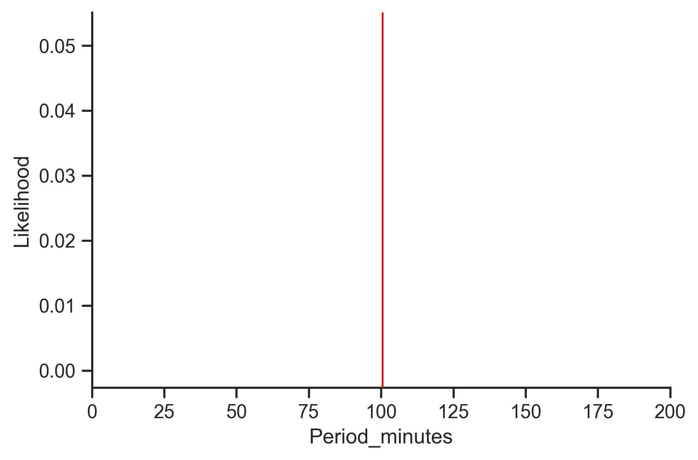
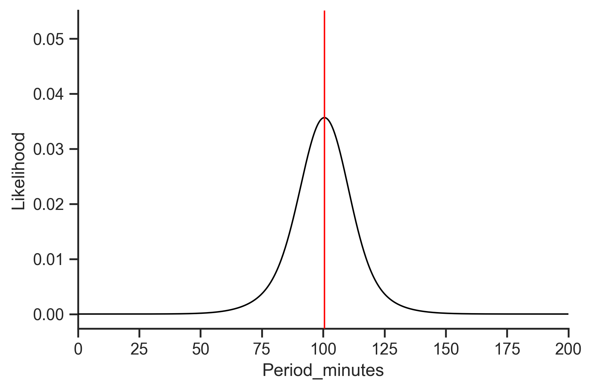
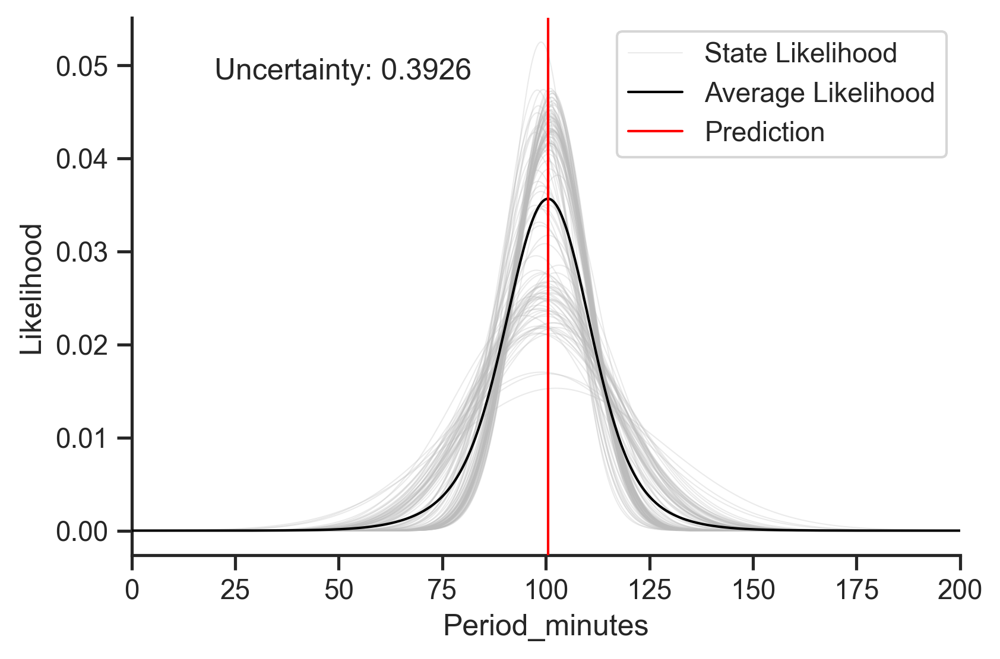
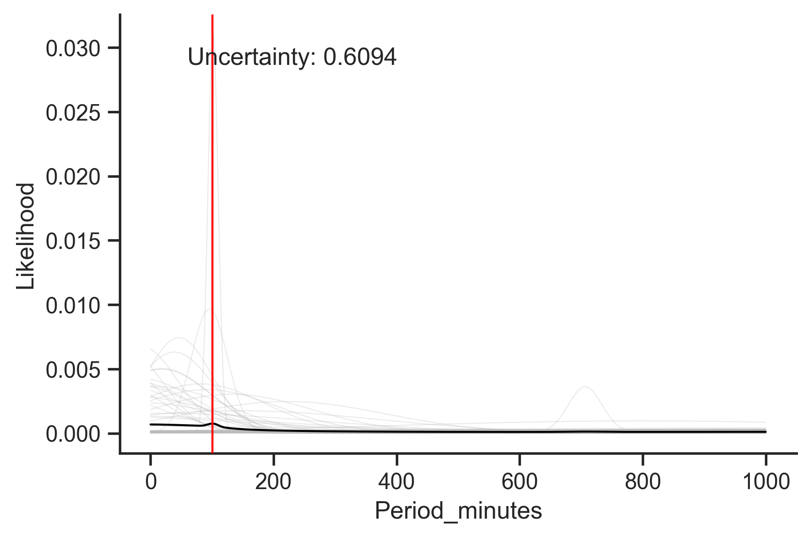
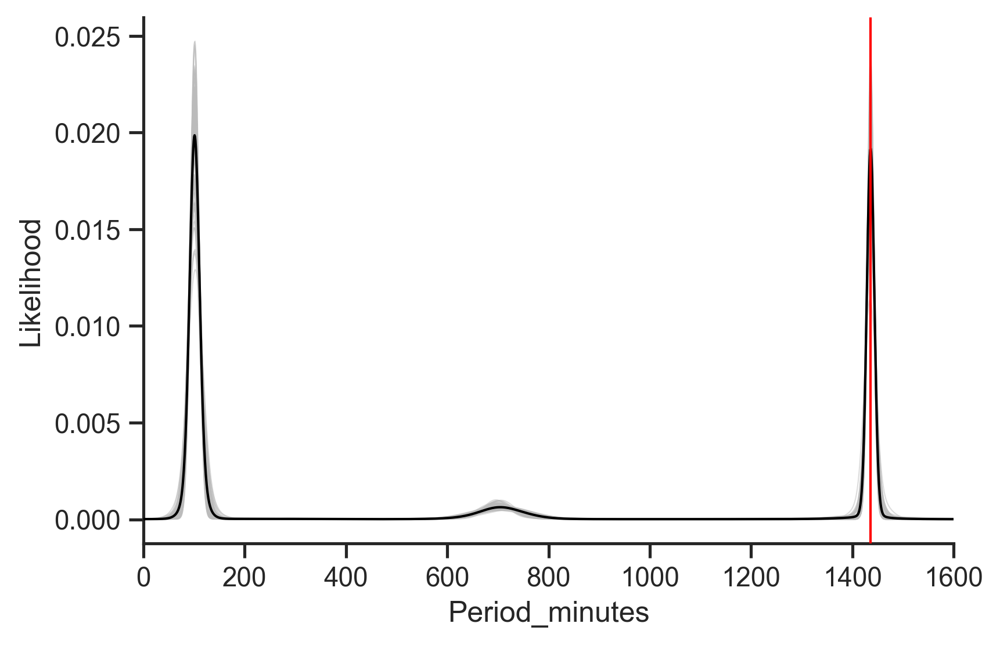

+++
title = "Identifying and visualizing different sources of uncertainty in machine learning"
date = 2022-01-26
template = "post.html"
draft = false

[taxonomies]
categories = ["ml", "ai", "uncertainty"]

[extra]
author = "Baxter Eaves"
subheading = "How the Redpoll platform conveys uncertainty information to promote appropriate trust, and to guide efficient data collection"
image = "stormy-beach-above.jpeg"
theme = "light-transparent"
front_page = true
+++

Lack of trust prevents wide adoption of machine learning in high-risk sectors. Frankly, machine learning doesn't exactly do much to build trust: you build a model, provide a set of inputs, and your ML model returns a number. That's the prediction. Take it or leave it. How certain is the model about this number? How certain are we? If there is uncertainty, what is its source? Is it the data? Are our measurements overly noisy? Should we invest in more precise data collection? Or is the model having a hard time? Should we apply our efforts toward improving the model? Or are we missing some critical data and doomed from the start?

In this post we'll discuss different sources of uncertainty in machine learning &mdash; the world, the model, missing features &mdash; and show how the Redpoll platform can identify and differentiate uncertainty from different sources.

For this post, I'll be predicting the orbital period (the time it takes to complete an orbit) of a satellite from the [Union of Concerned Scientists satellites dataset](https://ucsusa.org/resources/satellite-database).

If we were to load these data into, say, a random forest and then hit *predict*, we'd get a number:



One number on an infinite Real line. We might be able to do some digging about which features are important to the prediction, but on the whole, we're not going to get much information regarding uncertainty in this prediction. For any given prediction there are many sources of uncertainty, some from the data and some from the model, and to make the safest decisions possible, we need to understand them all.

# Uncertainty from the data

The world is a noisy place and there will always be some imprecision in the data. Thus, no matter how well we model the data, there will always be some natural variance in the prediction. With Redpoll, the goal is never to predict a value, the goal is to model probability distributions, which capture the likelihood of every prediction value. We can easily access a conditional distribution which describes a prediction

```python
import numpy as np
import pandas as pd
import redpoll as rp

# Pull in the original dataset to get the prediction conditions (inputs).
df = pd.read_csv('satellites.csv', index_col=0)
conditions = df.loc['Landsat 7'].dropna().to_dict()

# Set a range of x-values over which to compute the likelihood
period = pd.DataFrame({
    'Period_minutes': np.linspace(0, 200)
})

# connect to a deployed service for this dataset
c = rp.Client(MY_SERVICE_URL, dataset='satellites')

# predict the most likely value
pred = c.predict(
    'Period_minutes',      # predict target
    given=conditions,      # "inputs" to prediction
    uncertainty_type=None  # Don't return uncertainty info
)

# compute the log likelihood: log p(target|conditions)
loglike = c.logp(period, given=conditions)
```

Note that in the Redpoll platform, we return uncertainty information by default; you must ask not to return it.

Visualizing this distribution gives us this:



From this figure we understand where the prediction lies (the highest value on the curve) and how far out likely values extend.

# Uncertainty from the model

Regardless of how well we model the data ("All models are wrong..." as the ancients say), our model will doubtless have some difficulty in capturing some predictions. We'd like to know how difficult, or easy, of a time the model is having with these predictions: how certain is the model in its ability to capture a prediction. This is one of the great failures of the mainstream ML paradigm. We fit one model (parameter set) to our data, and we use optimization methods to ensure our model best accounts for the values of the data, rather than the process that generated the data, and in doing so, we lose out on (un)certainty information. We might get the value of an optimization objective (loss function) or maybe softmax probabilities, but none of these are helpful for the purpose at hand. The best approach for understanding model uncertainty is the Bayesian approach. For simple toy models, we can sometimes compute parameter uncertainty directly via the *posterior distribution*, but much, much more often than not, we must approximate things using posterior samples. That is what Redpoll does. Each posterior sample, which we refer to as *states*, represents an independent set of parameters with an independent explanation of the data. The average of these samples is the model we used to generate the above figure. We define certainty as the agreement between these samples. If the predictive distribution emitted by all states is completely identical we have zero uncertainty; if all the states' predictive distributions are infinitely divergent, the uncertainty is 1 (this would never happen but it gives the number meaning).

We can get the individual state predictive distributions like this:

```python
loglikes = []
for state_ix in range(c.n_states()):
    ll = c.logp(period, given=conditions, state_ixs=[state_ix])
    loglikes.append(ll)
```

And plotting everything together gives us something like this:



Here the light lines are the state-level predictive distributions. It looks like most of the models agree about the predicted value (have close modes), though there is a bit of disagreement surrounding the variance (width) of the prediction, which is what drives the fairly high uncertainty number. Nevertheless, I think we can be pretty confident in this prediction.

However, we might not be so certain about this one:



It seems that the prediction here is mainly a result of two samples predicting a low-earth orbit for this particular satellite.

# Uncertainty from missing features
Here's another scenario. How do we know if we are missing data features important for the prediction? Multi-modality in the predictive distribution is a good indicator. Imagine that we have all the data and know everything. In this case, there can only be one value for the prediction, or, in a world with small amounts of measurement noise, one mode for our predictive distribution. So if our predictive distribution has two or more distinct modes, we know we don't have all the data and don't know everything. For example:



Here we predict the orbital period of a satellite without providing the orbital characteristics. We see that the predictive distribution has three distinct modes: one at ~100 minutes, one at ~700 minutes, and one at ~1440 minutes. Using our strong satellite expertise, we know that these three modes correspond to classes of orbit: low, mid, and geosynchronous orbit. If we could get our hands on that feature, we'd likely be able to rule out two of those three modes. In this way, quantifying uncertainty can not only help us to appropriately trust (or distrust) our models for safer decision making, but can also help guide our data collection efforts to help us build stronger models in the future.

# Conclusion

Making safe decisions requires understanding how certain you are in your knowledge of the situation, so any tool used for decision support should transparently convey its uncertainty to its users. However, machine learning, on the whole, is notoriously bad at this, causing a lack of trust and ultimately a lack of successful adoption in high-risk, high-impact domains.

Uncertainty in machine learning comes from several sources: 
- The data contains an innate amount of natural variance, which leads to uncertainty.
- The model is a source of uncertainty. For example, a model may easily capture a high-variance prediction or may have difficulty with a low-variance prediction.
- Much of our uncertainty comes from not having all the information. Having too little information prevents us from ruling out alternative predictions and can manifest as multimodality in the predictive distribution.

We showed that the Redpoll platform can identify all these uncertainties, allowing decision-makers to appropriately trust or distrust predictions, build stronger datasets, and make safe decisions.
