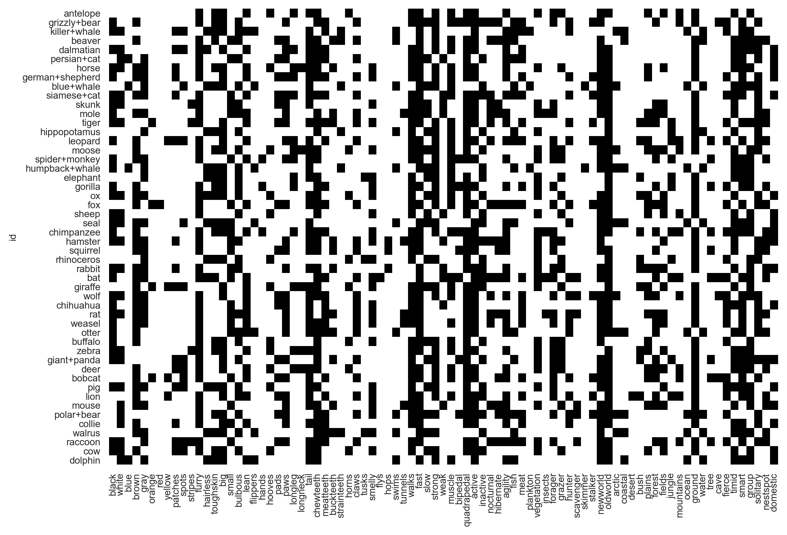

+++
title = "Faster and cheaper with stream-native artificial intelligence"
date = 2021-02-18
template = "post.html"
draft = false

[taxonomies]
categories = ["ai", "science"]

[extra]
author = "Baxter Eaves"
subheading = ""
image = "star-trails-1.jpg"
theme = "light-transparent"
+++

Data collection is a never-ending process because data _generation_ is a
never-ending process. As such, all data are streaming data. But today's machine
learning pipelines are largely incompatible with streams. When we collect new
data (or edit/backfill existing data), we have to throw out the old model and
retrain. If we have a vast quantity of data and/or complex models, this process
can take weeks. Not only are we burning money, but while we're sitting and
waiting, the world is changing. And by the time to model is trained it could
already be invalid.

Stream-native AI learns from streams of data. We can add new data or new
features, or edit or fill in existing data without having to retrain. Results
are contemporaneous. Insights are instant.


Let's work through a streaming example using Reformer. Here, we use a wide
version of [the zoo dataset](https://archive.ics.uci.edu/ml/datasets/Zoo). Each
of the 50 rows of the dataset is an animal and each of the 85 columns is a
feature of an animal. A cell is 1 if the animal has that feature and 0
otherwise. For example, the cell `(otter, swims)` is 1 because otters swim.

The dataset rendered:



Generally, when we start a new machine learning project, the first thing we
must do is generate a model around the _existing_ data that we already have.
Here we will use the Redpoll python client.

First, we build a model from our csv file and output it to `zoo.rp`.

```python
import redpoll as rp

rp.funcs.run('zoo.csv', output='zoo.rp')
```

Then we start a server interface into the model we just built and connect a
client to it.

```python
# The default server address is localhost:8000
server_proc = rp.funcs.server('zoo.rp')
c = rp.client('0.0.0.0:8000')
```

Let's see if we can find a data entry error to fix. Let's ask reformer which
animals are surprisingly `fierce`.

```python
# Client functions return pandas dataframes
c.surprisal("fierce") \
    .sort_values(by=["surprisal"], ascending=False) \
    .head(5)
```

|             | fierce | surprisal |
|:------------|:------:| ----------|
|         pig |      1 |  1.518649 |
|     buffalo |      1 |  1.090165 |
|  rhinoceros |      1 |  1.090165 |
|  chimpanzee |      1 |  0.732008 |
| persian+cat |      0 |  0.713934 |

According to the dataset, pigs are fierce. According to Reformer, this is
surprising &mdash; it surprised me.

Let's say that we believed pigs being labeled as fierce was an error.
Typically, we would go to the csv file, change the cell `(pig, fierce)` from 1
to 0, then retrain the model, re-validate, etc. However, with reformer we just
update the data in-place. No re-training or waiting. We can immediately re-run
the same query and see the result.

```python
c.update_data(row="pig", column="fierce", value=0)

c.surprisal("fierce") \
    .sort_values(by=["surprisal"], ascending=False) \
    .head(5)
```

|             | fierce | surprisal |
|:------------|:------:|-----------|
|     buffalo |      1 |  1.090165 |
|  rhinoceros |      1 |  1.090165 |
|  chimpanzee |      1 |  0.732008 |
| persian+cat |      0 |  0.713934 |
|      collie |      0 |  0.694322 |

The pig is no longer on the list because reformer has updated its knowledge in
real time.

Let's add a new animal to the dataset. If you're a fan of *Star Trek* (TOS),
you may have heard of [tribbles](https://memory-alpha.fandom.com/wiki/Tribble).
Tribbles are small balls of fur, which, in groups, are capable of planetary
devastation. I'm not an expert on tribble lore, but I know that they do not
hunt, they are toothless, and they are very fierce.

We will add the new animal, and immediately run the surprisal query.

```python
c.append_row(
    "tribble",
    values={"hunter": 0, "meatteeth": 0, "fierce": 1}
)

c.surprisal("fierce") \
    .sort_values(by=["surprisal"], ascending=False) \
    .head(5)
```

|             | fierce | surprisal |
|:------------|:------:|-----------|
|     tribble |      1 |  1.194812 |
|     buffalo |      1 |  1.090165 |
|  rhinoceros |      1 |  1.090165 |
|  chimpanzee |      1 |  0.732008 |
| persian+cat |      0 |  0.713934 |

Reformer is surprised that tribbles are fierce. It makes sense: they do not
hunt nor do they have meat teeth. Notice that the dataset has 85
features/columns but we have only provided 3. Reformer is fine with partial
data and can use what it knows about other animals to make inferences about the
missing values in tribble.

# Wrap up

Data are a stream. While we sit around burning money and compute cycles waiting
for machine learning models to catch up with our data, the world is changing
and we are at risk of falling behind.

The Reformer platform handles streaming data natively. Users can add new
records, add new features, and edit/backfill existing data without retraining.
Information is instant and always up-to-date, ensuring that you stay ahead of
your data and ahead of the world.
